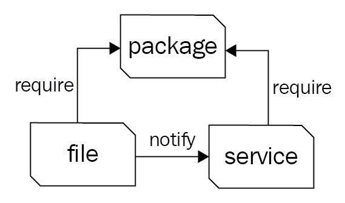

Lab 1. Puppet Language and Style
---------------------------------------------


We will cover the following recipes in this lab:


- Adding a resource to a node
- Using facter to describe a node
- Using Puppet facts
- Installing a package before starting a service
- Installing, configuring, and starting a service
- Using community Puppet style
- Installing Puppet
- Creating a manifest
- Checking your manifests with Puppet-lint
- Making modules
- Using standard naming conventions
- Using in-line templates
- Iterating over multiple terms
- Writing powerful conditional statements
- Using regular expressions in `if` statements
- Using selectors and case statements
- Using the `in` operator
- Using regular expression substitutions
- Puppet 5 changes
- Puppet 4/5 Changes


Introduction
------------------------------


In this lab, we\'ll start with the basics of the Puppet syntax and
show you how some of the syntactic sugar in Puppet is used. We\'ll then
move on to how Puppet deals with dependencies and how to make Puppet do
the work for you.

We\'ll look at how to organize and structure your code into modules
following community conventions so that other people will find it easy
to read and maintain your code. We will also see some powerful features
of the Puppet language, which will let you write concise yet expressive
manifests.


Adding a resource to a node
---------------------------------------------


This recipe will introduce[]{#id325440456
.indexterm} the language and show you the basics of
writing Puppet code. Puppet code files are
called **manifests**; manifests declare resources. A resource
in Puppet may be a type, class, or node. A **type** is
something like a file or package or anything
that has a type declared in the language. The current list of standard
types is available on the puppetlabs website at
<https://puppet.com/docs/puppet/latest/type.html>. I find myself
referencing this site very often. You may define your own types, either
using a mechanism, similar to a subroutine, named defined types,
extending the language using a custom type. Types are the heart of the
language; they describe the things that make up a **node**
(node is the word Puppet uses for client computers/devices). Puppet uses
**resources** to describe the state of a node; for example,
we will declare the following package resource for a node using a site
manifest: `site.pp`.


### How to do it\...


Create a `site.pp` file and place the following code in it:

``` 
node default {
  package { 'httpd':
    ensure => 'installed'
  }
 }
```


### How it works\...


This manifest will ensure that any
node on which this manifest is applied will
install a package called `httpd`. The default keyword is a
wildcard to Puppet; it applies anything within the node
`default` definition to any node. When Puppet applies the
manifest to a node, it uses a **Resource Abstraction Layer**
(**RAL**) to translate the package
type into the package management system of the target node. What this
means is that we can use the same manifest to install the
`httpd` package on any system where Puppet has a Provider for
the package type. Providers are the pieces of code that do the real work
of applying a manifest. When the previous code is applied to a node
running on a YUM-based distribution, the YUM provider will be used to
install the `httpd` RPM packages. When the same code is
applied to a node running on an APT-based distribution, the APT provider
will be used to install the `httpd` DEB package (which may not
exist, as most Debian-based systems call this package
`apache2`; we\'ll deal with this sort of naming problem
later).


Using facter to describe a node
-------------------------------------------------


Facter is a separate utility upon which
Puppet depends. It is the system used by
Puppet to gather information about the target system (node);
`facter` calls the nuggets of information facts. You may run
`facter` from the command line to obtain real-time information
from the system.


### How to do it\...


We\'ll compare the output of facter with that of system utilities:


1.  Use `facter` to find the current `uptime` of the
    system, the `uptime` fact:


``` 
t@fenago ~$ facter uptime 0:12 hours
```


2.  Compare this with the output of the Linux `uptime`
    command:


``` 
t@fenago ~$ uptime
01:18:52 up 12 min, 1 user, load average: 0.00, 0.00, 0.00
```


### How it works\...


When `facter` is installed (as a dependency for Puppet),
several fact definitions are
installed by default. You can reference each
of these facts by name from the command line.


### There\'s more\...


Running `facter` without any arguments causes
`facter` to print all the facts known about the system. We
will see in later chapters that `facter` can be extended with
your own custom facts. All facts are available for you to use as
variables; variables are discussed in the next section.


#### Variables


Variables in Puppet are marked with a
`$` character. Variables are immutable; once assigned a value,
they cannot be changed. When using variables within a manifest, it is
advisable to enclose the variable within braces, such as
`${myvariable}`, instead of `$myvariable`. All of
the facts from `facter` can be referenced as top-scope
variables (we will discuss scope in the next section). For example, the
**Fully Qualified Domain Name** (**FQDN**) of the
node may be referenced by
`${::fqdn}`. Variables can only contain alphabetic characters,
numerals, and the underscore character, `_`. As a matter of
style, variables should start with an alphabetic character. Never use
dashes in variable names.


#### Scope


In the variable example explained in the
previous paragraph, the FQDN was referred to as `${::fqdn}`
rather than `${fqdn}`; the double colons are how Puppet
differentiates scope. The highest level scope, top-scope, or global is
referred to by two colons, as in `::`, at the beginning of a
variable identifier. To reduce namespace collisions, always use fully
scoped variable identifiers in your manifests. A Unix user can think of
top-scope variables such as the `/` (root) level. You can
refer to variables using the double colon syntax, similar to how you
would refer to a directory by its full path. A developer can think of
top-scope variables as global variables; however, unlike global
variables, you must always refer to them with the double colon notation
to guarantee that a local variable isn\'t obscuring the top-scope
variable. In Puppet5, it is advisable to use the `$facts`
fact, so the previous would be `${facts['fqdn']}`. When
referring to a variable, the braces ({}) are optional outside of a
string, as shown in the following example:

``` 
$fqdn_ = $facts['fqdn']
notify {"::fqdn is ${::fqdn}": }
notify {"fqdn_ is ${fqdn_}": }
notify {"facts['fqdn'] is ${facts['fqdn']}": }
```


This produces the following output:

``` 
t@mylaptop ~ $ puppet apply fqdn.pp
Notice: Compiled catalog for mylaptop.example.com in environment production in 0.01 seconds
Notice: ::fqdn is mylaptop.example.com
Notice: /Stage[main]/Main/Notify[::fqdn is mylaptop.example.com]/message: defined 'message' as '::fqdn is mylaptop.example.com'
Notice: fqdn_ is mylaptop.example.com
Notice: /Stage[main]/Main/Notify[fqdn_ is mylaptop.example.com]/message: defined 'message' as 'fqdn_ is mylaptop.example.com'
Notice: facts['fqdn'] is mylaptop.example.com
Notice: /Stage[main]/Main/Notify[facts['fqdn'] is mylaptop.example.com]/message: defined 'message' as 'facts[\'fqdn\'] is mylaptop.example.com'
Notice: Applied catalog in 0.02 seconds
```


#### Note

`$fqdn_` is used to avoid a namespace collision with the
top-scope `::fqdn`.


Using puppet facts
------------------------------------


As we\'ll see in subsequent chapters,
`facter`may be extended with custom
facts written in Ruby. By default, custom facts are not loaded when you
run `facter`.


### How to do it\...


To pull in the custom facts, you need to specify the `-p`
option to `facter`, as shown here:

``` 
t@fenago:~$ facter puppetversion

t@fenago:~$ facter -p puppetversion
5.5.2
```


Although still valid, the `facter -p` syntax is now deprecated
in favor of using the Puppet face, facts. Puppet faces are the various
sub-applications supported by the `Puppet` command. To see the
available faces, run `Puppet help`, as shown here:

``` 
t@fenago:~$ puppet help

Usage: puppet <subcommand> [options] <action> [options]

Available subcommands:

 agent             The puppet agent daemon
 apply             Apply Puppet manifests locally
 ca                Local Puppet Certificate Authority management. (Deprecated)
 catalog           Compile, save, view, and convert catalogs.
 cert              Manage certificates and requests
 certificate       Provide access to the CA for certificate management.
 certificate_request  Manage certificate requests. (Deprecated)
 certificate_revocation_list  Manage the list of revoked certificates. (Deprecated)
 config            Interact with Puppet's settings.
 describe          Display help about resource types
 device            Manage remote network devices
 doc               Generate Puppet references
 epp               Interact directly with the EPP template parser/renderer.
 facts             Retrieve and store facts.
 filebucket        Store and retrieve files in a filebucket
 generate          Generates Puppet code from Ruby definitions.
 help              Display Puppet help.
 key               Create, save, and remove certificate keys. (Deprecated)
 lookup            Interactive Hiera lookup
 man               Display Puppet manual pages.
 master            The puppet master daemon
 module            Creates, installs and searches for modules on the Puppet Forge.
 node              View and manage node definitions.
 parser            Interact directly with the parser.
 plugin            Interact with the Puppet plugin system.
 report            Create, display, and submit reports.
 resource          The resource abstraction layer shell
 status            View puppet server status. (Deprecated)
```


One difference between `facter` and `Puppet facts`
is that you may request a single fact from facter, whereas Puppet facts
will return all the facts for a node at once as a JSON object (you may
request other formats with the `--render-as` option).


Installing a package before starting a service
----------------------------------------------------------------


To show how ordering works, we\'ll create a
manifest that installs `httpd` and then ensures the
`httpd` package service is running.


### How to do it\...


We\'ll create a manifest to install and start our service:


1.  Start by creating a manifest that defines `service`:


``` 
service {'httpd':
  ensure  => running,
  require => Package['httpd'],
}
```


2.  The `service` definition references a `package`
    resource named `httpd`; we now need to define that
    resource:


``` 
package {'httpd':
  ensure => 'installed',
}
```


### How it works\...


In this example, the package will be installed before the service is
started. Using `require` within the definition of the
`httpd` service ensures that the package is installed first,
regardless of the order within the manifest file.

Capitalization is important in Puppet. In our previous example, we
created a package named `httpd`. If we wanted to refer to this
package later, we would capitalize its type (package) as follows:

``` 
Package['httpd']
```


To refer to a class- for example, the `something::somewhere`
class, which has already been included/defined in your manifest-you can
reference it with the full path as follows:

``` 
Class['something::somewhere']
```


Let\'s say you have defined the following type:

``` 
example::thing {'one':}
```


The preceding line may be referenced later, as follows:

``` 
Example::Thing['one']
```


Knowing how to reference previously defined resources is necessary for
the next section on metaparameters and ordering.


#### Learning metaparameters and ordering


All the manifests that will be used to define
a node are compiled into a catalog. A catalog
is the code that will be applied to configure a node. It is important to
remember that manifests are not applied to nodes sequentially. There is
no inherent order to the application of manifests. With this in mind, in
the previous `httpd` example, what if we wanted to ensure that
the `httpd` process started after the `httpd`
package was installed?

We couldn\'t rely on the `httpd` service coming after the
`httpd` package in the manifests. What we would have to do is
use metaparameters to tell Puppet the order in which we want resources
applied to the node. Metaparameters are parameters that can be applied
to any resource and are not specific to any one resource type. They are
used for catalog compilation and as hints to Puppet, but not to define
anything about the resource to which they are attached.

When dealing with ordering, there are four metaparameters used:


- `before`
- `require`
- `notify`
- `subscribe`


The `before` and `require` metaparameters specify a
direct ordering; `notify` implies
`before` and `subscribe` implies require. The
`notify` metaparameter is only applicable to services; what
`notify` does is tell a service to restart after the notifying
resource has been applied to the node (this is most often a package or
file resource). In the case of files, once the file is created on the
node, a `notify` parameter will restart any services
mentioned. The `subscribe` metaparameter has the same effect
but is defined on the service; the service will `subscribe` to
the file.


#### Trifecta


The relationship between package and service
previously mentioned is an important and powerful paradigm of Puppet.
Adding one more resource-type file into the fold creates what puppeteers
refer to as the trifecta. Almost all system administration tasks revolve
around these three resource types. As a system administrator, you
install a package, configure the package with files, and then start the
service:





Diagram of the trifecta (files require package for directory; service
requires files and package)


#### Idempotency


A key concept of Puppet is that the state of the system[]{#id325458844
.indexterm} when a manifest is applied to a node cannot affect the
outcome of the Puppet run. In other words, at the end of the Puppet run
(if the run was successful), the system will be in a known state and any
further application of the manifest will result in a system that is in
the same state. This property of Puppet is known as idempotency.
Idempotency is the property that, no matter how many times you do
something, remains in the same state as the first time you did it. For
instance, if you had a light switch and you gave the instruction to turn
it on, the light would turn on. If you gave the instruction again, the
light would remain on.


Installing, configuring, and starting a service
-----------------------------------------------------------------


There are many examples of this pattern online. In our
simple example, we will create[]{#id325440455
.indexterm} an Apache configuration file under
`/etc/httpd/conf.d/fenago.conf`. The
`/etc/httpd/conf.d` directory will not exist until the
`httpd` package is installed. After this file is created, we
would want `httpd` to restart to
notice the change; we can achieve this with a notify parameter.


### How to do it\...


We will need the same definitions as our last example; we need the
package and service installed. We now need two more things. We need the
configuration file and index page (`index.html`) created. For
this, we follow these steps:


1.  As in the previous example, we ensure the service is running and
    specify that the service requires the `httpd` package:


``` 
service {'httpd':
  ensure  => running,
  require => Package['httpd'],
}
```


2.  We then define `package` as follows:


``` 
package {'httpd':
  ensure => installed,
}
```


<span style="color:red;">Note: Apache2 cannot start because port 80 is already in use. We will change the port first.</span>


#### Change Apache Port

Let's change the default Apache port. Open `/etc/apache2/ports.conf` in vscode and update `80` with port `81`. Save and close the file.


3.  Now, we create the `/etc/httpd/conf.d/fenago.conf`
    configuration file; the `/etc/httpd/conf.d` directory will
    not exist until the `httpd` package is installed. We\'ll
    use `@heredoc` syntax here to make the code a little more
    readable, assigning the `fenago.conf` contents to
    the `$fenago` variable. The require metaparameter tells
    Puppet that this file requires the `httpd` package to be
    installed before it is created:


``` 
$fenago = @(FENAGO)
  <VirtualHost *:81>
    Servername fenago
    DocumentRoot /var/www/fenago
  </VirtualHost>
  | FENAGO
file {'/etc/httpd/conf.d/fenago.conf':
  content => $fenago,
  require => Package['httpd'],
  notify => Service['httpd'],
}
```


4.  We then go on to create an
    `index.html` file for our virtual host in
    `/var/www/fenago`. Again, we\'ll use
    `@heredoc` syntax to make this more readable. This
    directory won\'t exist yet, so we need to create[]{#id325450948
    .indexterm} this as well, using the following code:


``` 
$index = @(INDEX)
  <html>
    <body>
      <h1>Hello World!</h1>
    </body>
  </html>
  | INDEX
file {'/var/www/fenago':
  ensure  => directory,
  require => Package['httpd'],
}
file {'/var/www/fenago/index.html':
  content => $index,
  require => File['/var/www/fenago'],
}
```


### How it works\...


The require attribute to the file resources tells Puppet that we need
the `/var/www/fenago` directory created before we can create
the `index.html` file. The important concept to remember is
that we cannot assume anything about the target system (node). We need
to define everything on which the target depends. Anytime you
create a file in a manifest, you have to
ensure that the directory containing that file exists. Anytime you
specify that a service should be running, you have to ensure that the
package providing that service is installed.

In this example, using metaparameters, we can be confident that no
matter what state the node is in before running Puppet, after Puppet
runs, the following will be true:


- `httpd` will be running
- The `VirtualHost` configuration file will exist
- `httpd` will restart and be aware of the
    `VirtualHost` file
- The `DocumentRoot` directory will exist
- An `index.html` file will exist in the
    `DocumentRoot` directory


Using community Puppet style
----------------------------------------------


If other people need to read or maintain your
manifests, or if you want to share code with the community, it\'s a good
idea to follow the existing style conventions as closely as possible.
These govern such aspects of your code as layout, spacing, quoting,
alignment, and variable references, and the official puppetlabs
recommendations on style are available at
[https://puppet.com/docs/puppet/latest/style\_guide.html.](https://puppet.com/docs/puppet/latest/style_guide.html){.ulink}


### How to do it\...


In this section, I\'ll show you a few of the more important examples and
how to make sure that your code is style compliant.


#### Indentation


Indent your manifests using two spaces (not
tabs), as follows:

``` 
service {'httpd':
  ensure => 'running',
}
```


#### Quoting


Always quote your resource names, as follows:

``` 
package { 'exim4': }
```


We cannot do this though:

``` 
package { exim4: }
```


Use single quotes for all strings, except when:


- The string contains variable references, such as
    `${::fqdn}`
- The string contains character escape sequences, such as
    `\n`


Consider the following code:

``` 
file { '/etc/motd':
  content => "Welcome to ${::fqdn}\n"
}
```


Puppet doesn\'t process variable references or escape sequences unless
they\'re inside double quotes.

Always quote parameter values that are not reserved words in Puppet. For
example, the following values are not reserved words:

``` 
name  => 'Nucky Thompson',
mode  => '0700',
owner => 'deploy',
```


However, these values are reserved words and therefore not quoted:

``` 
ensure => installed,
enable => true,
ensure => running,
```


#### false


There is only one thing in Puppet that is
`false`, that is, the word `false` without any
quotes. The string `false` evaluates to true and the string
`true` also evaluates to true. Actually, everything besides
the literal false evaluates to true (when treated as a Boolean):

``` 
if "false" {
  notify { 'True': }
}
if 'false' {
  notify { 'Also true': }
}
if false {
  notify { 'Not true': }
}
```


When this code is run through `puppet apply`, the first two
notifies are triggered. The final notify is not triggered; it is the
only one that evaluates to false.


#### Variables


Always include curly braces `{}` around variable names when
referring to them in strings, for example, as
follows:

``` 
source => "puppet:///modules/webserver/${brand}.conf",
```


Otherwise, the `Puppet` parser has to guess which characters
should be a part of the variable name and which belong to the
surrounding string. Curly braces make it explicit.


#### Parameters


Always end lines that declare parameters with
a comma, even if it is the last parameter:

``` 
service { 'memcached':
  ensure => running,
  enable => true,
}
```


This is allowed by Puppet, and makes it easier if you want to add
parameters later, or reorder the existing parameters.

When declaring a resource with a single parameter, make the declaration
all on one line and with no trailing comma, as shown in the following
snippet:

``` 
package { 'puppet':
  ensure => installed
}
```


Where there is more than one parameter, give each parameter its own
line:

``` 
package { 'rake':
  ensure   => installed,
  provider => gem,
  require  => Package['rubygems'],
}
```


To make the code easier to read, line up the parameter arrows in line
with the longest parameter, as follows:

``` 
file { "/var/www/${app}/shared/config/rvmrc":
  owner   => 'deploy',
  group   => 'deploy',
  content => template('rails/rvmrc.erb'),
  require => File["/var/www/${app}/shared/config"],
}
```


The arrows should be aligned per resource, but not across the whole
file, otherwise it may be difficult for you to cut and paste code from
one file to another.


#### Symlinks


When declaring file resources that are symlinks, use the
`ensure =>` link and set the target
attribute, as follows:

``` 
file { '/etc/php5/cli/php.ini':
  ensure => link,
  target => '/etc/php.ini',
}
```


Installing Puppet
-----------------------------------


You may install Puppet locally on your
machine or create a virtual machine and install Puppet on that machine.


### How to do it\...


For YUM-based systems, use
[https://yum.puppetlabs.com/puppet5](https://yum.puppetlabs./){.ulink},
and for APT-based systems, use <https://apt.puppetlabs.com/>. Use the
`puppet5-release-[version].deb` package to install Puppet 5.
After installing the YUM release RPM or the APT release source package,
install the puppet-agent package. The puppet-agent package installs all
the files necessary to support Puppet in agent mode on a node.

You may also use `gem` to install Puppet:


1.  To use `gem`, we need the `rubygems` package as
    follows:


``` 
t@fenago:~$ sudo yum install rubygems
 Resolving Dependencies
 --> Running transaction check
 ---> Package rubygems.noarch 0:2.0.14.1-30.el7 will be installed
 ...
 Installed:
  rubygems.noarch 0:2.0.14.1-30.el7
```


2.  Now, use `gem` to install Puppet:


``` 
t@fenago:~$ gem install puppet

Fetching: facter-2.5.1.gem (100%)
Successfully installed facter-2.5.1
Fetching: hiera-3.4.2.gem (100%)
Successfully installed hiera-3.4.2
Fetching: fast_gettext-1.1.0.gem (100%)
Successfully installed fast_gettext-1.1.0
Fetching: locale-2.1.2.gem (100%)
Successfully installed locale-2.1.2
Fetching: text-1.3.1.gem (100%)
Successfully installed text-1.3.1
Fetching: gettext-3.2.6.gem (100%)
Successfully installed gettext-3.2.6
Fetching: gettext-setup-0.29.gem (100%)
Successfully installed gettext-setup-0.29
Fetching: puppet-5.0.0.gem (100%)
Successfully installed puppet-5.5.2
Parsing documentation for facter-2.5.1
Installing ri documentation for facter-2.5.1
Parsing documentation for hiera-3.4.2
Installing ri documentation for hiera-3.4.2
Parsing documentation for fast_gettext-1.1.0
Installing ri documentation for fast_gettext-1.1.0
Parsing documentation for locale-2.1.2
Installing ri documentation for locale-2.1.2
Parsing documentation for text-1.3.1
Installing ri documentation for text-1.3.1
Parsing documentation for gettext-3.2.6
Installing ri documentation for gettext-3.2.6
Parsing documentation for gettext-setup-0.29
Installing ri documentation for gettext-setup-0.29
Parsing documentation for puppet-5.5.2
Installing ri documentation for puppet-5.5.2
8 gems installed
```


For the examples in this course, I suggest using the puppet-agent
package installation. The package
installation method of Puppet uses the **AIO**
(**All-In-One**) mentality. The puppet-agent
package installs all the necessary support
files for Puppet and does not rely on system libraries and applications.
The most important dependency is Ruby: the AIO `puppet-agent`
package installs a Puppet-specific Ruby that has been tested against the
version of Puppet to which it belongs.


Creating a manifest
-------------------------------------


If you already have some Puppet code (known
as a Puppet manifest), you can skip this section and go on to the next.
If not, we\'ll see how to create and apply a simple manifest.


### How to do it\...


To create and apply a simple manifest, follow these steps:


1.  With Puppet installed in the previous section, we can create a
    directory to contain our Puppet code:


``` 
t@fenago:~$ mkdir -p .puppet/manifests
t@fenago:~$ cd .puppet/manifests
t@fenago:manifests$
```


2.  Within your manifests directory, create the `site.pp` file
    with the following content:


``` 
 node default {
   file { '/tmp/hello':
     content => "Hello, world!\n",
   }
 }
```


3.  Test your manifest with the `puppet apply` command. This
    will tell Puppet to read the manifest, compare it to the state of
    the machine, and make any necessary changes to that state:


``` 
t@fenago:manifests$ puppet apply site.pp
Notice: Compiled catalog for fenago.example.com in environment production in 0.05 seconds
Notice: /Stage[main]/Main/Node[default]/File[/tmp/hello]/ensure: defined content as '{md5}746308829575e17c3331bbcb00c0898b'
Notice: Applied catalog in 0.07 seconds
```


4.  To see if Puppet did what we expected
    (created the `/tmp/hello` file with the Hello, world!
    content), run the following command:


``` 
t@fenago:manifests$ cat /tmp/hello
Hello, world!
```


Note that creating the file in `/tmp` did not require special
permissions. We did not run Puppet via `sudo`. Puppet need not
be run through `sudo`; there are cases where running via an
unprivileged user can be useful.


### There\'s more\...


When several people are working on a code base, it\'s easy for style
inconsistencies to creep in. Fortunately, there\'s a tool available that
can automatically check your code for compliance with the style guide:
`puppet-lint`. We\'ll see how to use this in the next section.


Checking your manifests with puppet-lint
----------------------------------------------------------


The Puppet official style guide outlines a number[]{#id325420295
.indexterm} of style conventions for Puppet
code, some of which we\'ve touched on in the preceding section. For
example, according to the style guide, manifests:


- Must use two-space soft tabs
- Must not use literal tab characters
- Must not contain trailing white space
- Should not exceed an 80-character line width
- Should align parameter arrows (`=>`) within blocks


Following the style guide will make sure that your Puppet code is easy
to read and maintain, and if you\'re planning to release your code to
the public, style compliance is essential.

The `puppet-lint` tool will automatically check your code
against the style guide. The next section explains how to use it.


### Getting ready


Here\'s what you need to do to install `puppet-lint`:


1.  We\'ll install Puppet-lint using the gem provider because the gem
    version is much more up to date than the APT or RPM packages
    available. Create a `puppet-lint.pp` manifest as shown in
    the following code snippet:


``` 
package {'puppet-lint':
  ensure   => 'installed',
  provider => 'gem'
}
```


2.  Run `puppet apply` on the `puppet-lint.pp`
    manifest, as shown in the following command:


``` 
t@fenago:manifests$ puppet apply puppet-lint.pp
Notice: Compiled catalog for fenago.example.com in environment production in 1.04 seconds
Notice: /Stage[main]/Main/Package[puppet-lint]/ensure: created
Notice: Applied catalog in 0.93 seconds
```


### How to do it\...


Follow these steps to use Puppet-lint:


1.  Choose a Puppet manifest file that you
    want to check with
    `Puppet-lint`, and run the following command:


``` 
t@fenago:manifests$ puppet-lint puppet-lint.pp
WARNING: indentation of => is not properly aligned (expected in column 12, but found it in column 10) on line 2
ERROR: trailing whitespace found on line 4
```


2.  As you can see, `Puppet-lint` found a number of problems
    with the manifest file. Correct the errors, save the file, and rerun
    `Puppet-lint` to check that all is well. If successful,
    you\'ll see no output:


``` 
t@fenago:manifests$ puppet-lint puppet-lint.pp
t@fenago:manifests$
```


### There\'s more\...


Should you follow Puppet style guide and, by extension, keep your code
lint-clean? It\'s up to you, but here are a couple of things to think
about:


- It makes sense to use some style conventions, especially when
    you\'re working collaboratively on code. Unless you and your
    colleagues can agree on standards for whitespace, tabs, quoting,
    alignment, and so on, your code will be messy and difficult to read
    or maintain.
- If you\'re choosing a set of style conventions to follow, the
    logical choice would be those issued by Puppet and adopted by the
    community for use in public modules.


Having said that, it\'s possible to tell `Puppet-lint` to
ignore certain checks if you\'ve chosen not to adopt them in your code
base. For example, if you don\'t want `puppet-lint` to warn
you about code lines exceeding 80 characters, you can run
`puppet-lint` with the following option:

``` 
puppet-lint --no-80chars-check
```


Most developers have terminals with more than 80 characters now; the
check for 80 characters is generally disabled in favor of a new
140-character limit. You may disable the 140 character check with the
following:

``` 
puppet-lint --no-140chars-check
```


Run `puppet-lint --help` to see the complete list of check
configuration commands.


### See also


- [*You can find out more
    about*]`Puppet-lint`[*at*]<https://github.com/rodjek/puppet-lint>.

- The [*Automatic syntax checking with Git hooks*] recipe
    in [Lab
    2],
    [*Puppet Infrastructure*]

- The [*Testing your manifests with rspec-puppet*] recipe
    in [Lab
    9],
    [*External Tools and the Puppet Ecosystem*]


Making modules
--------------------------------


One of the most important things you can do to make your Puppet
manifests clearer and more maintainable is to
organize them into modules.

Modules are self-contained bundles of Puppet code that include all the
files necessary to implement a thing. Modules may contain flat files,
templates, Puppet manifests, custom fact declarations, augeas lenses,
and custom Puppet types and providers.

Separating things into modules makes it easier to reuse and share code;
it\'s also the most logical way to organize your manifests. In this
example, we\'ll create a module to manage `memcached`, a
memory caching system commonly used with web applications.


### How to do it\...


Following are the steps to create an example module:


1.  We will use Puppet\'s module subcommand
    to create the directory structure for our new module, in our home
    directory (`/home/vagrant`):


``` 
[t@fenago ~]$ puppet module generate thomas-memcached
```


2.  We need to create a `metadata.json` file for this module.
    Please answer the following questions; if the question is not
    applicable to this module, feel free to leave it blank:


``` 
Puppet uses Semantic Versioning (semver.org) to version modules.What version is this module? [0.1.0]-->Who wrote this module? [thomas]-->What license does this module code fall under? [Apache-2.0]-->How would you describe this module in a single sentence?--> A module to install memcachedWhere is this module's source code repository?--> github.com/uphillian/thomas-memcachedWhere can others go to learn more about this module? [https://github.com/uphillian/thomas-memcached]-->Where can others go to file issues about this module? [https://github.com/uphillian/thomas-memcached/issues]-->{"name": "thomas-memcached","version": "0.1.0","author": "thomas","summary": "A module to install memcached","license": "Apache-2.0","source": "github.com/uphillian/thomas-memcached","project_page": "https://github.com/uphillian/thomasmemcached","issues_url": "https://github.com/uphillian/thomas-memcached/issues","dependencies": [{"name": "puppetlabs-stdlib","version_requirement": ">= 1.0.0"}]"data_provider": null}----------------------------------------About to generate this metadata; continue? [n/Y]--> yNotice: Generating module at /home/vagrant/memcached...Notice: Populating templates...Finished; module generated in memcached.memcached/specmemcached/spec/spec_helper.rbmemcached/spec/classesmemcached/spec/classes/init_spec.rbmemcached/metadata.jsonmemcached/manifestsmemcached/manifests/init.ppmemcached/Gemfilememcached/examplesmemcached/examples/init.ppmemcached/README.mdmemcached/Rakefile
```


This command creates the module directory and
creates some empty files as starting points.


3.  Now, edit `memcached/manifests/init.pp` and change the
    class definition at the end of the file to the following. Note that
    the `puppet module` created many lines of comments; in a
    `production` module, you would want to edit those default
    comments:


``` 
class memcached {
  package { 'memcached': ensure => installed, }
  file { '/etc/memcached.conf':
    source  => 'puppet:///modules/memcached/memcached.conf',
    owner   => 'root',
    group   => 'root',
    mode    => '0644',
    require => Package['memcached'],
 }
 service { 'memcached':
   ensure  => running,
   enable  => true,
   require => [Package['memcached'],
               File['/etc/memcached.conf']],
 }
}
```


4.  Create the `modules/thomas-memcached/files` directory and
    then create a file named `memcached.conf` with the
    following contents:


``` 
[t@fenago memcached]$ mkdir files
[t@fenago memcached]$ echo "-m 64 -p 11211 -u nobody -l 127.0.0.1" > files/memcached.conf
```


5.  We would like this module to install `memcached`. We\'ll
    need to run `Puppet` with root privileges, and we\'ll use
    `sudo` for that. We\'ll need `Puppet` to be able
    to find the module in our home directory;
    we can specify this on the command line when we run
    `Puppet`, as shown in the following code snippet:


``` 
t@fenago:memcached$ sudo /opt/puppetlabs/bin/puppet apply --modulepath=/home/vagrant -e 'include memcached'Warning: ModuleLoader: module 'memcached' has unresolved dependencies - it will only see those that are resolved. Use 'puppet module list --tree' to see information about modules  (file &amp; line not available)Notice: Compiled catalog for fenago.strangled.net in environment production in 0.46 secondsNotice: /Stage[main]/Memcached/Package[memcached]/ensure: createdNotice: /Stage[main]/Memcached/File[/etc/memcached.conf]/ensure: defined content as '{md5}febccf4a987759cf4f1558cc625fbea9'Notice: /Stage[main]/Memcached/Service[memcached]/ensure: ensure changed 'stopped' to 'running'Notice: Applied catalog in 6.99 seconds
```


6.  We can verify that `memcached` is running using
    `systemctl` or `puppet resource`:


``` 
t@fenago:memcached$ sudo /opt/puppetlabs/bin/puppet resource service memcached
service { 'memcached':
 ensure => 'running',
 enable => 'true',
}
t@fenago:memcached$ sudo systemctl status memcached
memcached.service - Memcached
  Loaded: loaded (/usr/lib/systemd/system/memcached.service; enabled; vendor preset: disabled)
  Active: active (running) since Thu 2017-12-28 05:17:41 UTC; 3min 28s ago
Main PID: 4057 (memcached)
  CGroup: /system.slice/memcached.service
          └─4057 /usr/bin/memcached -u memcached -p 11211 -m 64 -c 1024

Dec 28 05:17:41 fenago systemd[1]: Started Memcached.
Dec 28 05:17:41 fenago systemd[1]: Starting Memcached...
Note that /opt/puppetlabs/bin/puppet may not be in root's path, use the full path or add the path to a file in /etc/profile.d. 
```


### How it works\...


When we created the module using Puppet\'s module[]{#id325877356
.indexterm} generate command, we used the name
`thomas-memcached`. The name before the hyphen is your
username or your username on Puppet forge (an online repository of
modules). Modules have a specific directory structure. Not all of these
directories need to be present, but if they are, this is how they should
be organized:

``` 
modules/
└MODULE_NAME/ never use a dash (-) in a module name
└examples/ example usage of the module
└files/ flat files used by the module
└lib/
  └facter/ define new facts for facter
  └puppet/
    └parser/
      └functions/ define a new puppet function, like sort()
    └provider/ define a provider for a new or existing type
    └util/ define helper functions (in ruby)
    └type/ define a new type in puppet
└manifests/
└init.pp class MODULE_NAME { }
└spec/ rSpec tests
└templates/ EPP or ERB template files used by the module
```


All manifest files (those containing Puppet code) live in the manifests
directory. In our example, the memcached class is defined in the
`manifests/init.pp` file, which will be imported
automatically.

Inside the memcached class, we refer to the `memcached.conf`
file:

``` 
file { '/etc/memcached.conf':
  source => 'puppet:///modules/memcached/memcached.conf',
}
```


The preceding `source` parameter tells Puppet to look for the
file in:

``` 
MODULEPATH/ (/home/vagrant/)
 └memcached/
   └files/
     └memcached.conf
```


### There\'s more\...


Learn to love modules because they\'ll make your Puppet life a lot
easier. They\'re not complicated, however; practice and experience will
help you judge when things should be grouped into modules, and how best
to arrange your module structure. Modules can hold more than manifests
and files, as we\'ll see in the next two sections.


#### Templates


If you need to use a template as a part of
the module, place it in the module\'s templates directory and refer to
it as follows:

``` 
file { '/etc/memcached.conf':
  content => epp('memcached/memcached.conf.epp),
}
```


Puppet will look for the file in:

``` 
MODULEPATH/memcached/templates/memcached.conf.epp
```


#### Facts, functions, types, and providers


Modules can also contain custom facts,
custom functions, custom[]{#id325895066
.indexterm} types, and providers. For more information[]{#id325895075
.indexterm} about these, refer to [Lab
9],
[*External Tools and the Puppet Ecosystem*].


#### Third-party modules


You can download modules provided by other
people and use them in your own manifests just like the modules you
create. For more on this, see [Lab
7],
[*Using Public Modules*].


##### Module organization


For more details on how to organize your modules, see the
puppetlabs website:
<https://puppet.com/docs/puppet/latest/modules_fundamentals.html>.


### See also


- [*The Creating custom facts*] recipe in [Lab
    9],
    [*External Tools and the Puppet Ecosystem*]
- [*The Using public modules*] recipe in [Lab
    9],
    [*External Tools and the Puppet Ecosystem*]
- [*The Creating your own resource types*] recipe in
    [Lab
    9],
    [*External Tools and the Puppet Ecosystem*]
- [*The Creating your own providers*] recipe in [Lab
    9],
    [*External Tools and the Puppet Ecosystem*]


Using standard naming conventions
---------------------------------------------------


Choosing appropriate and informative names
for your modules and classes will be a big help when it comes to
maintaining your code. This is even truer if other people need to read
and work on your manifests.


### How to do it\...


Here are some tips on how to name things in your manifests:


1.  Name modules after the software or service they manage, for example,
    `apache` or `haproxy`.
2.  Name classes within modules (subclasses) after the function or
    service they provide to the module, for example,
    `apache::vhosts` or `rails::dependencies`.
3.  If a class within a module disables the service provided by that
    module, name it `disabled`. For example, a class that
    disables Apache should be named `apache::disabled`.


 


4.  Create a roles and profiles hierarchy of modules. Each node should
    have a single role consisting of one or more profiles. Each profile
    module should configure a single service.
5.  The module that manages users should be named user.
6.  Within the user module, declare your virtual users within the
    `user::virtual` class (for more on virtual users and other
    resources, see the [*Using virtual resources*] recipe in
    [Lab
    5],
    [*Users and Virtual Resources*]).
7.  Within the user module, subclasses for particular groups of users
    should be named after the group, for example,
    `user::sysadmins` or `user::contractors`.
8.  When using Puppet to deploy the config
    files for different services, name the file after the service, but
    with a suffix indicating what kind of file it is, for example:
    
    - Apache `init` script: `apache.init`
    - Logrotate config snippet for Rails: `rails.logrotate`
    - Nginx `vhost` file for mywizzoapp:
        `mywizzoapp.vhost.nginx`
    - MySQL config for standalone server: `standalone.mysql`
    - If you need to deploy a different version of a file depending on
        the operating system release, for example, you can use a naming
        convention like the following:
    

``` 
memcached.lucid.conf
memcached.precise.conf
```

- You can have Puppet automatically select the appropriate version as follows:

``` 
source = > "puppet:///modules/memcached /memcached.${::lsbdistrelease}.conf",
```


9.  If you need to manage, for example, different Ruby versions, name
    the class after the version it is responsible for; for example,
    `ruby192` or `ruby186`.


### There\'s more\...


Some people prefer to include multiple classes on a node by using a
comma-separated list, rather than separate include statements; for
example:

``` 
node 'server014' inherits 'server' {
 include mail::server, repo::gem, repo::apt, zabbix
}
```


This is a matter of style, but I prefer to use separate include
statements, one on a line, because it makes it easier to copy and move
around class inclusions between nodes without having to tidy up the
commas and indentation every time.

I mentioned inheritance in a couple of the preceding examples; if
you\'re not sure what this is, don\'t worry, I\'ll explain this in
detail in the next lab.


Using inline templates
----------------------------------------


Templates are a powerful way of using
**Embedded Puppet** (**EPP**) or
Embedded Ruby (ERB) to help build config
files dynamically. You can also use `EPP` or `ERB`
syntax directly without having to use a separate file by calling the
`inline_epp` or `inline_template` function.
`EPP` and `ERB` allow you to use conditional logic,
iterate over arrays, and include variables. `EPP` is the
replacement of `ERB`; `EPP` uses native Puppet
language. `ERB` uses Ruby language. `ERB` allows for
using native Ruby functions which may not be available in
`EPP`, so unless you need something Ruby specific, it is
better to go with the native `EPP` templates. In the following
example, we\'ll use a Ruby construct, so we\'ll use an `ERB`
inline template.


### How to do it\...


Here\'s an example of how to use inline\_template.

Pass your Ruby code to `inline_template` within the Puppet
manifest, as follows:

``` 
cron { 'chkrootkit':
  command => '/usr/sbin/chkrootkit > /var/log/chkrootkit.log 2>&amp;1',
  hour    => inline_template('<%= @hostname.sum % 24 %>'),
  minute  => '00',
}
```


### How it works\...


Anything inside the string passed to
`inline_template` is executed as if it were an ERB template.
That is, anything inside the `<%= and %>` delimiters will be
executed as Ruby code, and the rest will be treated as a string.

In this example, we use `inline_template` to compute a
different hour for this `cron` resource (a scheduled job) for
each machine, so that the same job does not run at the same time on all
machines. For more on this technique, see the [*Efficiently distributing
cron jobs*] recipe in [Lab
5],
[*Users and Virtual Resources*].


### There\'s more\...


In `ERB` code, whether inside a template file or an
`inline_template` string, you can access your Puppet variables
directly by name using an `@` prefix, if they are in the
current scope or the top scope (facts):

``` 
<%= @fqdn %>
```


To reference variables in another scope, use
`scope.lookupvar`, as follows:

``` 
<%= "The value of something from otherclass is " +
scope.lookupvar('otherclass::something') %>
```


You should use inline templates sparingly. If you really need to use
some complicated logic in your manifest, consider using a custom
function instead (see the [*Creating custom functions*]
recipe in [Lab
8],
[*External Tools and the Puppet Ecosystem*]). As we\'ll see
later, EPP templates use global scope for their variables; you always
refer to variables with their full scope.


### See also


- The [*Using ERB templates*] recipe in [Lab
    4],
    [*Working with Files and Packages*]
- The [*Using array iteration in templates*] recipe in
    [Lab
    4],
    [*Working with Files and Packages*]


Iterating over multiple items
-----------------------------------------------


Arrays are a powerful feature in Puppet; wherever[]{#id325420295
.indexterm} you want to perform the same operation on a list of things,
an array may be able to help. You can create an array just by putting
its content in square brackets:

``` 
$lunch = [ 'franks', 'beans', 'mustard' ]
```


### How to do it\...


Here\'s a common example of how arrays are used:


1.  Add the following code to your manifest:


``` 
$packages = [
  'ruby1.8-dev', 'ruby1.8',
  'ri1.8', 'rdoc1.8',
  'irb1.8', 'libreadline-ruby1.8',
  'libruby1.8', 'libopenssl-ruby'
]
package { $packages: ensure => installed }
```


2.  Run `Puppet` and note that each package should now be
    installed.


### How it works\...


Where Puppet encounters an array as the name
of a resource, it creates a resource for each element in the array. In
the example, a new package resource is created for each of the packages
in the `$packages` array, with the same
`ensure => installed` parameters. This is a very compact way
to instantiate many similar resources.


### There\'s more\...


Although arrays will take you a long way with Puppet, it\'s also useful
to know about an even more flexible data structure: the hash.


#### Using hashes


A hash is like an array, but each of the elements can be stored and
looked up by name (referred to as the key);
for example, `hash.pp`:

``` 
$interface = {
 'name' => 'eth0',
 'ip'   => '192.168.0.1',
 'mac'  => '52:54:00:4a:60:07'
}
notify { "(${interface['ip']}) at ${interface['mac']} on ${interface['name']}": }
```


When we run `Puppet` on this, we see the following notice in
the output:

``` 
t@fenago:~/.puppet/manifests$ puppet apply hash.pp
Notice: Compiled catalog for fenago.example.com in environment production in 0.04 seconds
Notice: (192.168.0.1) at 52:54:00:4a:60:07 on eth0
```


Hash values can be anything that you can assign to variables, strings,
function calls, expressions, and even other hashes or arrays. Hashes are
useful to store a bunch of information about a particular thing because
by accessing each element of the hash using a key, we can quickly find
the information we are looking for.


#### Creating arrays with the split function


You can declare literal arrays using
square brackets, as follows:

``` 
define lunchprint() {
 notify { "Lunch included ${name}":}
}
$lunch = ['egg', 'beans', 'chips']
lunchprint { $lunch: }
```


Now, when we run Puppet on the preceding code, we see the following
notice messages in the output:

``` 
t@fenago:~$ puppet apply lunchprint.pp
Notice: Compiled catalog for fenago.strangled.net in environment production in 0.02 seconds
Notice: Lunch included egg
Notice: Lunch included beans
Notice: Lunch included chips
Notice: Applied catalog in 0.04 seconds
```


However, Puppet can also create arrays for you from strings, using the
`split` function, as follows:

``` 
$menu = 'egg beans chips'
$items = split($menu, ' ')
lunchprint { $items: }
```


Running `puppet apply` against this new manifest, we see the
same messages in the output:

``` 
t@fenago:~$ puppet apply lunchprint2.pp
Notice: Compiled catalog for fenago.strangled.net in environment production in 0.02 seconds
Notice: Lunch included egg
Notice: Lunch included beans
Notice: Lunch included chips
Notice: Applied catalog in 0.21 seconds
```


#### Note

The split takes two arguments: the first argument is the string to be
split. The second argument is the character to split on. In this
example, it\'s a single space. As Puppet works its way through the
string, when it encounters a space, it will interpret it as the end of
one item and the beginning of the next. So, given the string egg, beans,
and chips, this will be split into three items.


The character to split on can be any character or string:

``` 
$menu = 'egg and beans and chips' $items = split($menu, ' and ')
```


The character can also be a regular expression, for example, a set of
alternatives separated by a `|` (pipe) character:

``` 
$lunch = 'egg:beans,chips'
$items = split($lunch, ':|,')
```


Writing powerful conditional statements
---------------------------------------------------------


Puppet\'s `if` statement allows you to change the
manifest behavior based on the value of a
variable or an expression. With it, you can apply different resources or
parameter values depending on certain facts about the node; for example,
the operating system or the memory size.

You can also set variables within the manifest, which can change the
behavior of included classes. For example, nodes in data center A might
need to use different DNS servers than nodes in data center B, or you
might need to include one set of classes for an Ubuntu system, and a
different set for other systems.


### How to do it\...


Here\'s an example of a useful conditional statement. Add the following
code to your manifest:

``` 
if $::timezone == 'UTC' {
  notify { 'Universal Time Coordinated':}
} else {
  notify { "$::timezone is not UTC": }
}
```


### How it works\...


Puppet treats whatever follows an if keyword
as an expression and evaluates it. If the expression evaluates to true,
Puppet will execute the code within the curly braces.

Optionally, you can add an else branch, which will be executed if the
expression evaluates to false.


### There\'s more\...


Lets take a look at some more tips on using `if` statements.


#### elsif branches


You can add further tests using the
`elsif` keyword, as follows:

``` 
if $::timezone == 'UTC' {
notify { 'Universal Time Coordinated': }
} elsif $::timezone == 'GMT' {
notify { 'Greenwich Mean Time': }
} else {
notify { "$::timezone is not UTC": }
}
```


#### Comparisons


You can check whether two values are equal
using the `==` syntax, as in our example:

``` 
if $::timezone == 'UTC' {
  ...
}
```


Alternatively, you can check whether they are not equal using
`!=`:

``` 
if $::timezone != 'UTC' {
  ...
}
```


You can also compare numeric values using `< and >`:

``` 
if $::uptime_days > 365 {
  notify { 'Time to upgrade your kernel!': }
}
```


To test whether a value is greater (or less) than or equal to another
value, use `<=` or `>=`:

``` 
if $::mtu_eth0 <= 1500 {
  notify {"Not Jumbo Frames": }
}
```


#### Combining expressions


You can put together the kind of simple expressions[]{#id325458748
.indexterm} described previously into more complex logical expressions,
using `and`, `or`, and `not`:

``` 
if ($::uptime_days > 365) and ($::kernel == 'Linux') {
  …
}
if ($role == 'webserver') and ( ($datacenter == 'A') or ($datacenter == 'B') ) {
  …
}
```


### See also


- [*The*][*Using the in operator*] recipe in
    this lab
- [*The*][*Using selectors and case statements*]
    recipe in this lab


Using regular expressions in if statements
------------------------------------------------------------


Another kind of expression you can test in
`if` statements and other
conditionals is the regular expression. A regular expression is a
powerful way to compare strings using pattern matching.


### How to do it\...


This is one example of using a regular expression in a conditional
statement. Add the following to your manifest:

``` 
if $::architecture =~ /64/ {
  notify { '64Bit OS Installed': }
} else {
  notify { 'Upgrade to 64Bit': }
  fail('Not 64 Bit')
}
```


### How it works\...


Puppet treats the text supplied between the forward slashes as a regular
expression, specifying the text to be matched. If the match succeeds,
the if expression will be true and so the code between the first set of
curly braces will be executed. In this example, we used a regular
expression because different distributions have different ideas on what
to call 64 bit; some use `amd64`, while others use
`x86_64`. The only thing we can count on is the presence of
the number 64 within the fact. Some facts that have version numbers in
them are treated as strings to Puppet. For instance,
`$::facterversion`. On my test system, this is 3.9.3, but when
I try to compare that with 3, Puppet fails to make the following
comparison:

``` 
if $::facterversion > 3 {
 notify {"Facter version 3": }
}
```


Which produces the following output when run with
`puppet apply`:

``` 
t@fenago:~$ puppet apply version.pp
Error: Evaluation Error: Comparison of: String > Integer, is not possible. Caused by 'A String is not comparable to a non String'. at /home/vagrant/version.pp:1:21 on node fenago.example.com
```


We could make the comparison with `=~` but that would match a
`3` in any position in the `version` string. Puppet
provides a function to compare versions, `versioncmp`, as
shown in this example:

``` 
if versioncmp($::facterversion,'3') > 0 {
  notify {"Facter version 3": }
}
```


Which now produces the desired result:

``` 
t@fenago:~$ puppet apply version2.pp
Notice: Compiled catalog for fenago.strangled.net in environment production in 0.01 seconds
Notice: Facter version 3
```


The `versioncmp` function returns `-1` if the first
parameter is a lower version than the second, `0` if the two
parameters are equal, or `1` if the second parameter is lower
than the first.

If you wanted instead to do something if the text does not match, use
`!~` rather than `=~`:

``` 
if $::kernel !~ /Linux/ {
  notify { 'Not Linux, could be Windows, MacOS X, AIX, or ?': }
}
```


### There\'s more\...


Regular expressions are very powerful, but can be difficult to
understand and debug. If you find yourself using a regular expression so
complex that you can\'t see at a glance what it does, think about
simplifying your design to make it easier. However, one particularly
useful feature of regular expressions is their ability to capture
patterns.


#### Capturing patterns


You can not only match text using a regular
expression, but also capture the matched text and store it in a
variable:

``` 
$input = 'Puppet is better than manual configuration'
if $input =~ /(.*) is better than (.*)/ {
  notify { "You said '${0}'. Looks like you're comparing ${1} to ${2}!": }
}
```


The preceding code produces this output:

``` 
Notice: You said 'Puppet is better than manual configuration'. Looks like you're comparing Puppet to manual configuration!
```


The `$0` variable stores the whole matched text (assuming the
overall match succeeded). If you put brackets around any part of the
regular expression, it creates a group, and any matched groups will also
be stored in variables. The first matched group will be `$1`,
the second `$2`, and so on, as shown in the preceding example.


#### Regular expression syntax


Puppet\'s regular expression syntax is the same as Ruby\'s, so resources
that explain Ruby\'s regular expression
syntax will also help you with Puppet. You can find a good introduction
to Ruby\'s regular expression syntax at this website:
<http://www.tutorialspoint.com/ruby/ruby_regular_expressions.htm>.


### See also


- Refer to the [*Using regular expression substitutions*]
    recipe in this lab


Using selectors and case statements
-----------------------------------------------------


Although you could write any conditional
statement using `if`, Puppet provides a couple of extra forms
to help you express conditionals more easily: the selector and the case
statement.


### How to do it\...


Here are some examples of selector and case
statements:


1.  Add the following code to your manifest:


``` 
$systemtype = $::operatingsystem ? {
  'Ubuntu' => 'debianlike',
  'Debian' => 'debianlike',
  'RedHat' => 'redhatlike',
  'Fedora' => 'redhatlike',
  'CentOS' => 'redhatlike',
  default  => 'unknown',
}
notify { "You have a ${systemtype} system": }
```


2.  Add the following code to your manifest:


``` 
class debianlike {
  notify { 'Special manifest for Debian-like systems': }
}
class redhatlike {
  notify { 'Special manifest for RedHat-like systems': }
}
case $::operatingsystem {
  'Ubuntu', 'Debian': { include debianlike },
  'RedHat', 'Fedora', 'CentOS', 'Springdale': { include redhatlike }
  default: { notify { "I don't know what kind of system you have!": } }
}
```


### How it works\...


Our example demonstrates both the selector and the case statement, so
let\'s see in detail how each of them works.


#### Selector


In the first example, we used a selector (the `?` operator) to
choose a value for the
`$systemtype` variable depending on the value of
`$::operatingsystem`. This is similar to the ternary operator
in C or Ruby, but instead of choosing between two possible values, you
can have as many values as you like.

Puppet will compare the value of `$::operatingsystem` to each
of the possible values we have supplied in Ubuntu, Debian, and so on.
These values could be regular expressions (for example, for a partial
string match or to use wildcards), but in our case, we have just used
literal strings.

As soon as it finds a match, the selector expression returns whatever
value is associated with the matching string. If the value of
`$::operatingsystem` is fedora, for example, the selector
expression will return the `redhatlike` string and this will
be assigned to the `$systemtype` variable.


#### Case statement


Unlike selectors, the case statement does not return a value. Case
statements come in handy when you want to execute different code
depending on the value of an expression. In
our second example, we used the case statement to include either the
`debianlike` or `redhatlike` class, depending on the
value of `$::operatingsystem`.

Again, Puppet compares the value of `$::operatingsystem` to a
list of potential matches. These could be regular expressions or
strings, or as in our example, comma-separated lists of strings. When it
finds a match, the associated code between curly braces is executed. So,
if the value of `$::operatingsystem` is Ubuntu, then the code
including `debianlike` will be executed.


### There\'s more\...


Once you\'ve got a grip on the basic use of selectors and case
statements, you may find the following tips useful.


#### Regular expressions


As with `if` statements, you can use regular expressions with
selectors and case statements, and you can
also capture the values of the matched groups and refer to them using
`$1`, `$2`, and so on:

``` 
case $::lsbdistdescription {
  /Ubuntu (.+)/: {
    notify { "You have Ubuntu version ${1}": }
  }
  /CentOS (.+)/: {
    notify { "You have CentOS version ${1}": }
  }
  default: {}
}
```


#### Defaults


Both selectors and case statements let you
specify a default value, which is chosen if none of the other options
match (the style guide suggests you always have a default clause
defined):

``` 
$lunch = 'Filet mignon.' $lunchtype = $lunch ? {
  /fries/ => 'unhealthy',
  /salad/ => 'healthy',
  default => 'unknown',
}
notify { "Your lunch was ${lunchtype}": }
```


The output is as follows:

``` 
t@fenago:~$ puppet apply lunchtype.pp
Notice: Compiled catalog for fenago.strangled.net in environment production in 0.01 seconds
Notice: Your lunch was unknown
```


When the default action dosen\'t occur, use the `fail()`
function to halt the Puppet run.


Using the in operator
---------------------------------------


The `in` operator tests whether one
string contains another string. Here\'s an example:

``` 
if 'spring' in 'springfield'
```


The preceding expression is true if the spring string is a substring of
`springfield`, which it is. The `in` operator can
also test for membership of arrays as follows:

``` 
if $crewmember in ['Frank', 'Dave', 'HAL' ]
```


When `in` is used with a hash, it tests whether the string is
a key of the hash:

``` 
$ifaces = {
  'lo'   => '127.0.0.1',
  'eth0' => '192.168.0.1'
}
if 'eth0' in $ifaces {
  notify { "eth0 has address ${ifaces['eth0']}": }
}
```


### How to do it\...


The following steps will show you how to use the `in`
operator:


1.  Add the following code to your manifest:


``` 
if $::operatingsystem in [ 'Ubuntu', 'Debian' ] {
  notify { 'Debian-type operating system detected': }
} elsif $::operatingsystem in [ 'RedHat', 'Fedora', 'SuSE', 'CentOS' ] {
  notify { 'RedHat-type operating system detected': }
} else {
  notify { 'Some other operating system detected': }
}
```


2.  Run Puppet:


``` 
t@fenago:~$ puppet apply in.pp
Notice: Compiled catalog for fenago.example.com in environment production in 0.01 seconds
Notice: RedHat-type operating system detected
```


### There\'s more\...


The value of an in expression is Boolean (true or false) so you can
assign it to a variable:

``` 
$debianlike = $::operatingsystem in [ 'Debian', 'Ubuntu' ]
if $debianlike {
  notify { 'You are in a maze of twisty little packages, all alike': }
}
```


Using regular expression substitutions
--------------------------------------------------------


Puppet\'s `regsubst` function provides an easy way to
manipulate text, search and replace
expressions within strings, or extract patterns from strings. We often
need to do this with data obtained from a fact, for example, or from
external programs.

In this example, we\'ll see how to use `regsubst` to extract
the first three octets of an IPv4 address (the network part, assuming
it\'s a /24 class C address).


### How to do it\...


Follow these steps to build the example:


1.  Add the following code to your manifest:


``` 
$class_c = regsubst($::ipaddress, '(.*)\..*', '\1.0')
notify { "The network part of ${::ipaddress} is ${class_c}": }
```


2.  Run Puppet:


``` 
t@fenago:~$ puppet apply regsubst.pp
Notice: Compiled catalog for fenago.strangled.net in environment production in 0.02 seconds
Notice: The network part of 10.0.2.15 is 10.0.2.0
```


### How it works\...


The `regsubst` function takes at least three parameters:
source, pattern, and replacement. In our example, we specified the
source string as `$::ipaddress`, which, on this machine, is as
follows:

``` 
10.0.2.15
```


We specify the pattern function as follows:

``` 
(.*)\..*
```


We specify the replacement function as follows:

``` 
\1.0
```


The pattern captures all of the string up to the last period
(`\.`) in the `\1` variable. We then match on
`.*`, which matches everything to the end of the string, so
when we replace the string at the end with `\1.0`, we end up
with only the network portion of the IP address, which
evaluates to the following:

``` 
10.0.2.0
```


We could have got the same result in other ways, of course, including
the following:

``` 
$class_c = regsubst($::ipaddress, '\.\d+$', '.0')
```


Here, we only match the last octet and replace it with `.0`,
which achieves the same result without capturing.


### There\'s more\...


The pattern function can be any regular expression, using the same
(Ruby) syntax as regular expressions in `if` statements.


### See also


- [*The*][*Importing dynamic information*]
    recipe in [Lab
    3],
    [*Writing Better Manifests*]
- [*The Getting information about the environment*] recipe
    in [Lab
    3],
    [*Writing Better Manifests*]
- [*The Using regular expressions in if statements*] recipe
    in this lab


Puppet 5 changes
----------------------------------


Prior to Puppet 4, Puppet 3 had a preview of
the Puppet 4 language named the future parser. The future parser feature
allowed you to preview the language changes that would be coming to
Puppet 4 before upgrading. Most of these features were related to
iterating on objects and have been carried forward to Puppet 5. In this
section, we will cover the major changes in Puppet 5. A good place to
check for language changes are the release notes. While writing this
course, I\'m using Puppet 5.5.2, so I need to check the release
notes for
Puppet 5.5(<https://puppet.com/docs/puppet/5.5/release_notes.html>), 5.0
(<https://puppet.com/docs/puppet/5.0/release_notes.html>), 5.1
(<https://puppet.com/docs/puppet/5.1/release_notes.html>), 5.2
(<https://puppet.com/docs/puppet/5.2/release_notes.html>), and 5.3
(<https://puppet.com/docs/puppet/5.3/release_notes.html>).


### Using the call function


Puppet 5 adds a new function, `call`. This
function is useful for calling a
function by name using a variable. In the
following example, we change the function we use depending on a
variable:

``` 
if versioncmp($::puppetversion,'4.0') {
  $func = 'lookup'
 } else {
  $func = 'hiera'
 }
 $val = call($func,'important_setting')
 notify {"\$val = $val, \$func = $func": }
```


If the version of Puppet is lower than `4.0`, the
`hiera` function will be called; if not, `lookup`
will be used.

