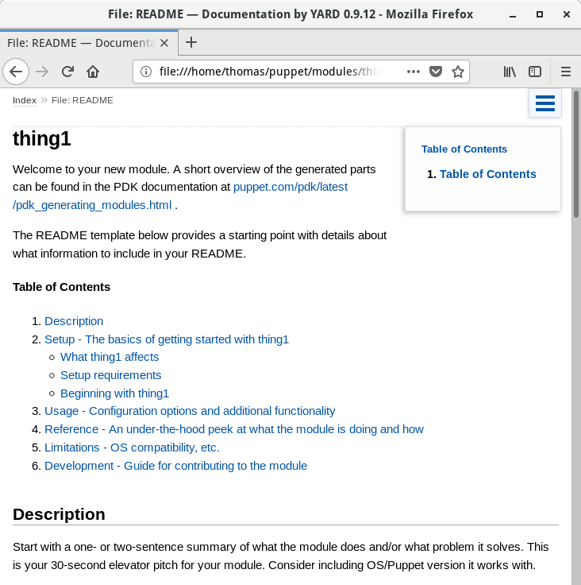
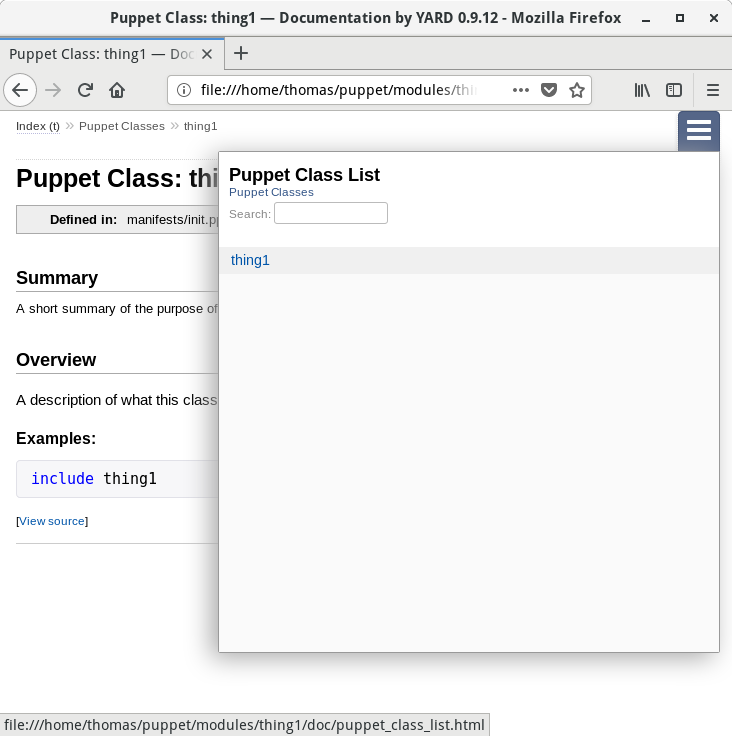
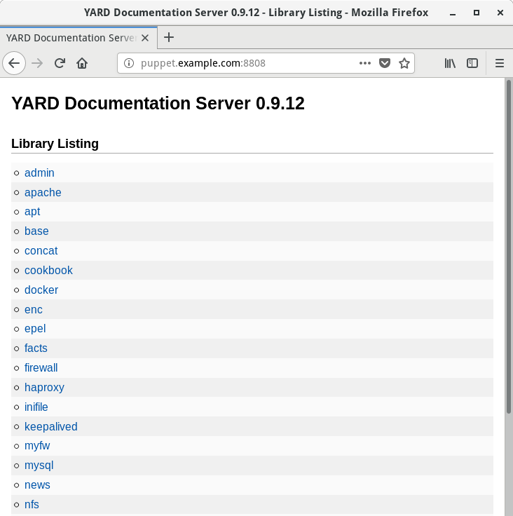
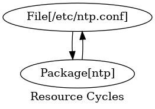
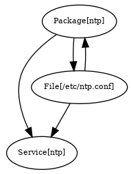

Lab 4. Monitoring, Reporting, and Troubleshooting
---------------------------------------------------------------


In this lab, we will cover the following recipes:


- Noop---the don\'t-change-anything option
- Logging the command output
- Logging debug messages
- Generating reports
- Producing automatic HTML documentation
- Drawing dependency graphs
- Understanding Puppet errors
- Inspecting configuration settings


Introduction
-------------------------------


Most of us had the experience of sitting in an exciting presentation
about some new technology and then rushing home to play with it. Of
course, once you start experimenting with it, you immediately run into
problems. What\'s going wrong? Why doesn\'t it work? How can I see
what\'s happening under the hood? This lab will help you answer some
of these questions, and give you the tools to solve common Puppet
problems.

We\'ll also see how to generate useful reports on your Puppet
infrastructure and how Puppet can help you monitor and troubleshoot your
network as a whole.


Noop---the don\'t-change-anything option
-----------------------------------------------------------


Sometimes, your Puppet manifest doesn\'t do exactly what you expected, or perhaps someone else has checked in
changes you didn\'t know about. Either way, it\'s good to know exactly
what Puppet is going to do before it does it.

When you are retrofitting Puppet into an existing infrastructure, you
might not know whether Puppet is going to update a config file or
restart a production service. Any such change could result in unplanned
downtime. Also, sometimes, manual configuration changes are made on a
server that Puppet would overwrite.

To avoid these problems, you can use Puppet\'s `noop` mode,
which means


> no operation


or do nothing. When run with the noop option, Puppet only reports what
it would do, but doesn\'t actually do anything. One caveat here is that
even during a `noop` run, `pluginsync` still runs
and any `lib` directories in modules will be synced to nodes.
This will update external fact definitions and possibly Puppet\'s types
and providers. If you are using PuppetDB for reporting, the fact values
for a node are also updated on a `noop` run.


### How to do it\...


You may run the `noop` mode when running
`puppet agent` or `puppet apply` by appending the
`--noop` switch to the command. You may also create a
`noop=true` line in your `puppet.conf` file within
the `[agent]` or `[main]` sections:


1.  Create a `noop.pp` manifest that creates a file, as
    follows:


``` 
file {'/tmp/noop':
  content => 'nothing',
  mode    => '0644',
}
```


2.  Run puppet agent with the `noop` switch:


``` 
t@mylaptop.example.com $ puppet apply noop.pp --noop
Notice: Compiled catalog for mylaptop.example.com.strangled.net in environment production in 0.02 seconds
Notice: /Stage[main]/Main/File[/tmp/noop]/ensure: current_value 'absent', should be 'file' (noop)
Notice: Class[Main]: Would have triggered 'refresh' from 1 event
Notice: Stage[main]: Would have triggered 'refresh' from 1 event
Notice: Applied catalog in 0.02 seconds
```


3.  Run it without the `noop` option to see that the file is
    created:


``` 
t@mylaptop.example.com $ puppet apply noop.pp
Notice: Compiled catalog for mylaptop.example.com.strangled.net in environment production in 0.01 seconds
Notice: /Stage[main]/Main/File[/tmp/noop]/ensure: defined content as '{md5}3e47b75000b0924b6c9ba5759a7cf15d'
Notice: Applied catalog in 0.02 seconds
```


### How it works\...


In the `noop` mode, Puppet does
everything it would normally, with the exception of actually making any
changes to the machine (the exec resources, for example, won\'t run). It
tells you what it would have done, and you can compare this with what
you expected to happen. If there are any differences, double-check the
manifest or the current state of the machine.

Note that when we ran with `--noop`, Puppet warned us that it
would have created the `/tmp/noop` file. This may or may not
be what we want, but it\'s useful to know in advance. If you are making
changes to the code applied to your production servers, it\'s useful to
run puppet agent with the `--noop` option to ensure that your
changes will not affect the production services.


### There\'s more\...


You can also use noop mode as a simple
auditing tool. It will tell you whether any changes have been made to
the machine since Puppet last applied its manifest. Some organizations
require all config changes to be made with Puppet, which is one way of
implementing a change-control process. Unauthorized changes to the
resources managed by Puppet can be detected using Puppet in noop mode
and you can then decide whether to merge the changes back into the
Puppet manifest or undo them.

You can also use the `--debug` switch in Puppet to see the
details of every resource Puppet considers in the manifest. This can be
helpful when trying to figure out whether Puppet is loading a particular
class, or to see in which order things are happening.

If you are running a master, you can compile the catalog for a node on
the master with the `--trace` option in addition to
`--debug`. If the catalog is failing to compile, this method
will also fail to compile the catalog (if you have an old definition for
the fenago node that is failing, try commenting it out before running
this test). This produces a lot of debugging output. For example, to
compile the catalog for our fenago, host on our master and place the
results in `/tmp/fenago.log`:

``` 
[root@puppet ~]# puppet master --compile fenago.example.com --debug --trace --logdest /tmp/fenago.log
{
 "tags": [
 "settings",
 "fenago",
 "node"
 ],
 "name": "fenago.example.com",
 "version": 1526923109,
 "code_id": null,
 "catalog_uuid": "f0efb635-8711-4c28-b5d6-245e813f1425",
...
```


After compiling the catalog, Puppet will print out the catalog to the
command line. The log file (`/tmp/fenago.log`) will have a
lot of information on how the catalog was compiled.


Logging the command output
---------------------------------------------


When you use the exec resources to run commands on the node,
Puppet will give you an error message such as
the following if a command returns a non-zero exit status:

``` 
Notice: /Stage[main]/Main/Exec[/bin/cat /tmp/missing]/returns: /bin/cat: /tmp/missing: No such file or directory
Error: /bin/cat /tmp/missing returned 1 instead of one of [0]
Error: /Stage[main]/Main/Exec[/bin/cat /tmp/missing]/returns: change from notrun to 0 failed: /bin/cat /tmp/missing returned 1 instead of one of [0]
```


As you can see, Puppet not only reports that the command failed, but
shows its output:

``` 
/bin/cat: /tmp/missing: No such file or directory
```


This is useful for figuring out why the command didn\'t work, but
sometimes the command actually succeeds (in that it returns a zero exit
status) but still doesn\'t do what we wanted. In that case, how can you
see the command output? You can use the `logoutput` attribute.


### How to do it\...


Follow these steps in order to log the command output:


1.  Define an exec resource with the `logoutput` parameter, as
    shown in the following code snippet:


``` 
exec { 'exec with output':
  command   => '/bin/cat /etc/hostname',
  logoutput => true,
}
```


2.  Run Puppet:


``` 
t@mylaptop $ puppet apply exec.pp
Notice: Compiled catalog for mylaptop.example.com in environment production in 0.05 seconds
Notice: /Stage[main]/Main/Exec[exec with output]/returns: mylaptop.example.com
Notice: /Stage[main]/Main/Exec[exec with output]/returns: executed successfully
Notice: Applied catalog in 0.02 seconds
```


3.  As you can see, even though the command succeeds, Puppet prints the
    output:


``` 
mylaptop.example.com
```


### How it works\...


The `logoutput` attribute has three possible settings:


- `false`: This never prints the command output
- `on_failure`: This only prints the output if the command
    fails (the default setting)
- `true`: This always prints the output, whether the command
    succeeds or fails


### There\'s more\...


You can set the default value of `logoutput` to always display
the command output for all exec resources by defining the following in
your `site.pp` file:

``` 
Exec { logoutput => true, }
```


What\'s this Exec syntax? It looks like an exec resource, but it\'s not.
When you use `Exec` with a capital E, you\'re setting the
resource default for exec. You may set the resource default for any
resource by capitalizing the first letter of the resource type. Anywhere
that Puppet sees that resource within the current scope or a nested
subscope, it will apply the defaults you define.

If you never want to see the command output, whether it succeeds or
fails, use:

``` 
logoutput => false,
```


More information is available at
<https://docs.puppetlabs.com/references/latest/type.html#exec>.


Logging debug messages
-----------------------------------------


It can be very helpful when debugging
problems if you can print out information at a certain point in the
manifest. This is a good way to tell, for example, whether a variable
isn\'t defined or has an unexpected value. Sometimes, it\'s useful just
to know that a particular piece of code has been run. Puppet\'s notify
resource lets you print out such messages.


### How to do it\...


Define a `notify` resource in your manifest at the point you
want to investigate:

``` 
notify { 'Got this far!': }
```


### How it works\...


When this resource is applied, Puppet will print out the message:

``` 
notice: Got this far!
```


### There\'s more\...


In addition to simple messages, we can output variables within our notify statements. Additionally, we can treat the
notify calls the same as other resources, having them require or be
required by other resources.

By printing out variable values, you can refer to variables in the
message:

``` 
notify {"operating system is ${facts['os']['name']}": }
```


Puppet will interpolate the values in the printout:

``` 
Notice: operating system is Fedora
```


#### Resource ordering


Puppet compiles your manifests into a catalog. The order in which
resources are executed on the client (node)
may not be the same as the order of the resources within your source
files. When you are using a notify resource for debugging, you should
use resource chaining to ensure that the notify resource is executed
before or after your failing resource.

For example, if the `exec failing exec` is failing, you can
chain a notify resource to run directly before the failed exec resource,
as shown here:

``` 
notify{"failed exec on ${hostname}": }
  -> exec {'failing exec':
       command   => "/bin/grep ${hostname} /etc/hosts",
       logoutput => true,
     }
```


If you don\'t chain the resource or use a metaparameter, such as
`before` or `require`, there is no guarantee that
your `notify` statement will be executed near the other
resources you are interested in debugging. More information on
resource ordering can be found at
<https://docs.puppetlabs.com/puppet/latest/reference/lang_relationships.html>.

For example, to have your notify resource run after
`failing exec` in the preceding code snippet, use:

``` 
notify { 'Resource X has been applied':
  require => Exec['failing exec'],
}
```


Note, however, that in this case the notify resource will fail to
execute, since the exec failed. When a resource fails, all the resources
that depended on that resource are skipped:

``` 
notify {'failed exec failed': require => Exec['failing exec'] }
```


When we run Puppet, we see that the notify resource is skipped:

``` 
t@mylaptop ~/puppet/manifests $ puppet apply fail.pp
...
Error: /bin/grepmylaptop /etc/hosts returned 1 instead of one of [0]
Error: /Stage[main]/Main/Exec[failing exec]/returns: change from notrun to 0 failed: /bin/grepmylaptop /etc/hosts returned 1 instead of one of [0]
Notice: /Stage[main]/Main/Notify[failed exec failed]: Dependency Exec[failing exec] has failures: true
Warning: /Stage[main]/Main/Notify[failed exec failed]: Skipping because of failed dependencies
Notice: Finished catalog run in 0.06 seconds
```


Generating reports
-------------------------------------


If you\'re managing a lot of machines, Puppet\'s
reporting facility can give you some valuable
information on what\'s actually happening out there.


### How to do it\...


To enable reports, just add this to a client\'s `puppet.conf`,
within the `[main]` or `[agent]` sections:

``` 
report = true
```


#### Note

In recent versions of Puppet, `report = true` is the default
setting.


### How it works\...


With reporting enabled, Puppet will generate a report file, containing
data such as:


- Date and time of the run
- Total time for the run
- Log messages output during the run
- List of all the resources in the client\'s manifest
- Whether Puppet changed any resources, and how many
- Whether the run succeeded or failed


By default, these reports are stored on the
node at `/opt/puppetlabs/puppet/cache/reports/` in a directory
named after the certname of the node (the FQDN), but you can specify a
different destination using the `reportdir` option in
`puppet.conf`. You can create your own scripts to process
these reports (which are in YAML format). When we run puppet agent on
`fenago.example.com`, the following file is created on the
master:

``` 
/opt/puppetlabs/server/data/puppetserver/reports/201805140434.yaml
```


### There\'s more\...


If you have more than one master server, you can have all your reports
sent to the same server by specifying `report_server` in the
`[agent]` section of `puppet.conf`.

If you just want one report, or you don\'t want to enable reporting all
the time, you can disable reporting by specifying
`report = false` in `puppet.conf` and then add the
`--report` switch to the command line when you run Puppet
manually:

``` 
[root@fenago ~]# puppet agent -t --report
Notice: Finished catalog run in 0.34 seconds
```


You won\'t see any output, but a report file will be generated in the
report directory.

You can also see some overall statistics about a Puppet run by supplying
the `--summarize` switch:

``` 
[root@fenago ~]# puppet agent -t --report --summarize
Info: Using configured environment 'production'
Info: Retrieving pluginfacts
Info: Retrieving plugin
Info: Loading facts
Info: Caching catalog for fenago.example.com
Info: Applying configuration version '1526924636'
Notice: Applied catalog in 0.05 seconds
Changes:
Events:
Resources:
            Total: 7
Time:
         Schedule: 0.00
   Transaction evaluation: 0.02
   Convert catalog: 0.04
   Catalog application: 0.05
   Node retrieval: 0.16
   Config retrieval: 0.31
      Plugin sync: 0.65
   Fact generation: 1.23
         Last run: 1526924636
       Filebucket: 0.00
            Total: 2.47
Version:
           Config: 1526924636
           Puppet: 5.5.0
```


Producing automatic HTML documentation
---------------------------------------------------------


As your manifests get bigger and more
complex, it can be helpful to create HTML documentation for your nodes
and classes using an automatic documentation tool, puppet strings.
Previous versions of Puppet included the `doc` option, which
was used to produce documentation. However, it was deprecated in favor
of puppet strings, a ruby gem.


### Getting ready\...


Install the puppet strings ruby gem. First install the YARD gem, then
puppet-strings:

``` 
t@mylaptop ~ $ sudo /opt/puppetlabs/puppet/bin/gem install yard
[sudo] password for thomas: 
Fetching: yard-0.9.12.gem (100%)
--------------------------------------------------------------------------------
As of YARD v0.9.2:

RubyGems "--document=yri,yard" hooks are now supported. You can auto-configure
YARD to automatically build the yri index for installed gems by typing:

$ yard config --gem-install-yri

See `yard config --help` for more information on RubyGems install hooks.

You can also add the following to your .gemspec to have YARD document your gem
on install:

    spec.metadata["yard.run"] = "yri" # use "yard" to build full HTML docs.

--------------------------------------------------------------------------------
Successfully installed yard-0.9.12
Parsing documentation for yard-0.9.12
Installing ri documentation for yard-0.9.12
Done installing documentation for yard after 2 seconds
1 gem installed
```


``` 
t@mylaptop ~ $ sudo /opt/puppetlabs/puppet/bin/gem install puppet-strings
Fetching: rgen-0.8.2.gem (100%)
Successfully installed rgen-0.8.2
Fetching: puppet-strings-2.0.0.gem (100%)
Successfully installed puppet-strings-2.0.0
Parsing documentation for rgen-0.8.2
Installing ri documentation for rgen-0.8.2
Parsing documentation for puppet-strings-2.0.0
Installing ri documentation for puppet-strings-2.0.0
Done installing documentation for rgen, puppet-strings after 2 seconds
2 gems installed
```


### How to do it\...


We\'ll use the `thing1` module we created with PDK. PDK does a great job of filling out all the
default comments that are used by puppet strings:


1.  Use `puppet` strings to generate the HTML documentation as
    follows:


``` 
t@mylaptop $ cd modules/thing1/home/thomas/puppet/modules/thing1
t@mylaptop $ puppet strings
Files: 1
Modules: 0 ( 0 undocumented)
Classes: 0 ( 0 undocumented)
Constants: 0 ( 0 ocumented)
Attributes: 0 ( 0 undocumented)
Methods: 0 ( 0 undocumented)
Puppet Classes: 1 ( 0 undocumented)
Puppet Defined Types: 0 ( 0 undocumented)
Puppet Types: 0 ( 0 undocumented)
Puppet Providers: 0 ( 0 undocumented)
Puppet Functions: 0 ( 0 undocumented)
Puppet Tasks: 0 ( 0 undocumented)
Puppet Plans: 0 ( 0 undocumented)
 100.00% documented
```


2.  This will generate a set of HTML files in a directory
    named doc in the current directory. Open
    the top-level index file at
    `modules/thing1/doc/index.html`:





3.  Click the **`hamburger`** menu on the right and select the
    `thing1` class:





### How it works\...


The puppet strings command creates a structured HTML
documentation tree similar to using YARD
(YARD is similar to RDoc, which was used previously). Puppet-strings
will use the comments in your code to generate the documentation.
Properly formatting your comments will make it easier to produce quality
documentation for your modules.


### There\'s more\...


Using the puppet strings server command, you can generate documentation
for all the modules known in the current environment. Puppet strings
will then start a web server and serve up your documentation. For
example, we can run the server command on our Puppet server, as follows:

``` 
[root@puppet ~]# puppet strings server
Generating documentation for Puppet module 'concat'.
[warn]: Missing a description for Puppet resource property 'ensure' at /etc/puppetlabs/code/environments/production/public/concat/lib/puppet/type/concat_file.rb:24.
...
Starting YARD documentation server.
[2018-05-21 20:19:19] INFO WEBrick 1.3.1
[2018-05-21 20:19:19] INFO ruby 2.4.2 (2017-09-14) [x86_64-linux] 
[2018-05-21 20:19:19] INFO WEBrick::HTTPServer#start: pid=25400 port=8808 
::1 - - [21/May/2018:20:23:24 UTC] "GET / HTTP/1.1" 200 2838 
- -> /
```


Now, when we point our web browser to port `8808` on our
puppet server, we see documentation for all the modules in our
environment:





Drawing dependency graphs
--------------------------------------------


Dependencies can get complicated quickly, and
it\'s easy to end up with a circular dependency (where A depends on B,
which depends on A) that will cause Puppet to complain and stop working.
Fortunately, Puppet\'s `--graph` option makes it easy to
generate a diagram of your resources and the dependencies between them,
which can be a big help in fixing such problems.


### Getting ready


Install the `graphviz` package to view the diagram files:

``` 
t@mylaptop ~ $ sudo puppet resource package graphviz ensure=installed
Notice: /Package[graphviz]/ensure: created
package { 'graphviz':
  ensure => '2.40.1-20.fc28',
}
```


### How to do it\...


Follow these steps to generate a dependency
graph for your manifest:


1.  Create a new `trifecta` module:


``` 
t@burnaby $ pdk new module trifecta
pdk (INFO): Creating new module: trifecta

We need to create the metadata.json file for this module, so we're going to ask you 4 questions.
If the question is not applicable to this module, accept the default option shown after each question. You can modify any answers at any time by manually updating the metadata.json file.

[Q 1/4] If you have a Puppet Forge username, add it here.\
We can use this to upload your module to the Forge when it's complete.
--> uphillian

[Q 2/4] Who wrote this module?
This is used to credit the module's author.
--> Thomas Uphill

[Q 3/4] What license does this module code fall under?
This should be an identifier from https://spdx.org/licenses/. Common values are "Apache-2.0", "MIT", or "proprietary".
--> GPL-3.0

[Q 4/4] What operating systems does this module support?
Use the up and down keys to move between the choices, space to select and enter to continue.
--> RedHat based Linux, Debian based Linux, Windows (Use arrow or number (1-7) keys, press Space to select and Ente--> RedHat based Linux, Debian based Linux
Metadata will be generated based on this information, continue? Yes
pdk (INFO): Module 'trifecta' generated at path '/home/thomas/puppet/modules/trifecta', from template 'file:///opt/puppetlabs/pdk/share/cache/pdk-templates.git'.
pdk (INFO): In your module directory, add classes with the 'pdk new class' command.
```


2.  Create the `init` class:


``` 
t@burnaby $ cd trifecta/home/thomas/puppet/modules/trifectat@burnaby 
$ pdk new class trifecta
pdk (INFO): Creating '/home/thomas/puppet/modules/trifecta/manifests/init.pp' from template.
pdk (INFO): Creating '/home/thomas/puppet/modules/trifecta/spec/classes/trifecta_spec.rb' from template.
```


3.  Place the following code, containing a
    deliberate circular dependency, in the `init` class (can
    you spot the problem?):


``` 
# A description of what this class does
#
# @summary A short summary of the purpose of this class
#
# @example
# include trifecta
class trifecta {
  package { 'ntp':
    ensure  => installed,
    require => File['/etc/ntp.conf'],
  }

  service { 'ntp':
    ensure  => running,
    require => Package['ntp'],
  }

  file { '/etc/ntp.conf':
    source  => 'puppet:///modules/trifecta/ntp.conf',
    notify  => Service['ntp'],
    require => Package['ntp'],
  }
}
```


4.  Create a simple `ntp.conf` file in
    `modules/trifecta/files/ntp.conf` with the following
    content:


``` 
server 127.0.0.1
```


5.  Run `Puppet apply` to generate the graph:


``` 
t@mylaptop $ puppet apply --modulepath ~thomas/puppet/modules -e 'include trifecta' --graph
Notice: Compiled catalog for burnaby.strangled.net in environment production in 0.01 seconds
Error: Found 1 dependency cycle:
(File[/etc/ntp.conf] => Package[ntp] => File[/etc/ntp.conf])\nCycle graph written to /home/thomas/.puppetlabs/opt/puppet/cache/state/graphs/cycles.dot.
Error: Failed to apply catalog: One or more resource dependency cycles detected in graph
```


6.  Convert the `cycles.dot` file to a PNG using the dot
    command, as follows:


``` 
t@mylaptop $ dot -Tpng /home/thomas/.puppetlabs/opt/puppet/cache/state/graphs/cycles.dot -o cycles.png
```


7.  View the PNG:
    
    
    


### How it works\...


When you run `puppet apply --graph` (or set
`graph=true` in `puppet.conf`), Puppet will generate
three graphs in the DOT format (a graphics language):


- `resources.dot`: This shows the
    hierarchical structure of your classes
    and resources, but without dependencies
- `relationships.dot`: This shows the dependencies between
    resources as arrows, as shown in the preceding image
- `expanded_relationships.dot`: This is a more detailed
    version of the relationships graph


If there is a dependency cycle in your code, then Puppet will also
generate a `cycles.dot` file. For our preceding code, the
`relationships.dot` file produces the following PNG:





The dot tool (part of the graphviz package) will convert these to an
image format, such as PNG, for viewing.

In the relationships graph, each resource in your manifest is shown as a
balloon (known as a vertex), with arrowed lines connecting them to
indicate the dependencies. You can see that, in our example, the
dependencies between `File['/etc/ntp.conf']` and
`Package['ntp']` are bidirectional. When Puppet tries to
decide where to begin applying these resources, it can start at
`File['/etc/ntp.conf']`, look for what depends on
`File['/etc/ntp. conf']`, and end up at
`Package['ntp']`.


#### When Puppet looks for the dependencies


This type of problem is known as a circular dependency problem; Puppet can\'t decide where to start because the two
resources depend on each other.

To fix the circular dependency problem, all you need to do is remove one
of the dependency lines and break the circle. The following code fixes
the problem:

``` 
class trifecta {
  package { 'ntp':
    ensure => installed,
  }

  service { 'ntp':
    ensure  => running,
    require => Package['ntp'],
  }

  file { '/etc/ntp.conf':
    source  => 'puppet:///modules/trifecta/ntp.conf',
    notify  => Service['ntp'],
    require => Package['ntp'],
  }
}
```


Now, when we run puppet apply or agent with the `--graph`
option, the resulting graph does not have any circular paths (cycles).

In this graph, it is easy to see that `Package[ntp]` is the
first resource to be applied, then `File[/etc/ntp.conf]`, and
finally `Service[ntp]`.

A graph such as that shown previously is
known as a **Directed Acyclic Graph** (**DAG**).
Reducing the resources to a DAG ensures that Puppet can calculate the
shortest path of all the vertices (resources) in linear time. For more
information on DAGs, check
out <http://en.wikipedia.org/wiki/Directed_acyclic_graph>.


### There\'s more\...


Resource and relationship graphs can be useful even when you don\'t have
a bug to find. If you have a very complex network of classes and
resources, for example, studying the resources graph can help you see
where to simplify things. Similarly, when dependencies become too
complicated to understand by reading the manifest, the graphs can be a
useful form of documentation. For instance, a graph will make it readily
apparent which resources have the most dependencies and which resources
are required by the most other resources. Resources that are required by
a large number of other resources will have numerous arrows pointing at
them.


Understanding Puppet errors
----------------------------------------------


Puppet\'s error messages can sometimes be a
little confusing. Updated and increasingly helpful error messages are
one reason to upgrade your Puppet installation if you are running any
version prior to Version 3.

Here are some of the most common errors you might encounter, and what to
do about them.


### How to do it\...


Often, the first step is simply to search the web for the error message
text and see what explanations you can find for the error, along with
any helpful advice about fixing it. Here are some of the most common
puzzling errors, with possible explanations.


#### Could not retrieve file metadata for XXX: getaddrinfo: Name or service not known


Where `XXX` is a file resource, you may have
accidentally typed
`puppet://modules...` in a file source instead of
`puppet:///modules...` (note the triple slash).


#### Could not evaluate: Could not retrieve information from environment production source(s) XXX


The source file may not be present or may not be in the right location
in the Puppet repo.


#### Error: Could not set \'file\' on ensure: No such file or directory XXX


The file path may specify a parent directory
(or directories) that doesn\'t exist. You can use separate file
resources in Puppet to create these. You will see this error if, for
example, you specified the `/etc/myProduct/config.ini` file
and the `/etc/myProduct` directory did not exist.


#### Change from absent to file failed: Could not set \'file on ensure: No such file or directory


This is often caused by Puppet trying to write a file to a directory
that doesn\'t exist. Check that the directory either exists already or
is defined in Puppet, and that the file resource requires the directory
(so that the directory is always created first). 


#### Note

Another thing to consider is that SELinux rules may prevent the file
from being created. Check the audit log for entries from Puppet
attempting to create the file. You may also encounter this with remote
file systems (NFS, Samba), where the local root user does not have
permission to create the file in question.


#### Undefined method \'closed?\' for nil:NilClass


This unhelpful error message is roughly translated as [*something went
wrong*]. It tends to be a catch-all error caused by many
different problems, but you may be able to determine what is wrong from
the name of the resource, the class, or the module. One trick is to add
the `--debug` switch, to get more useful information:

``` 
[root@fenago ~]# puppet agent -t --debug
```


If you check your Git history to see what was touched in the most recent change, this may be another way to
identify what\'s upsetting Puppet:


#### Duplicate definition: X is already defined in \[file\] at line Y; cannot redefine at \[file\] line Y


This one has caused me a bit of puzzlement in the past. Puppet\'s
complaining about a duplicate definition, and normally ,if you have two
resources with the same name, Puppet will helpfully tell you where they
are both defined. But in this case, it\'s indicating the same file and
line number for both. How can one resource be a duplicate of itself?

The answer is, if it\'s a defined type (a resource created with the
define keyword). If you create two instances of a defined type, you\'ll
also have two instances of all the resources contained within the
definition, and they need to have distinct names. For example:

``` 
define check_process() {
  exec { 'is-process-running?':
  command => "/bin/ps ax |/bin/grep ${name} >/tmp/pslist.${name}.txt",
  }
}
check_process { 'exim': }
check_process { 'nagios': }
```


When we run Puppet, the same error is printed twice:

``` 
t@mylaptop $ puppet apply duplicate.pp
Error: Evaluation Error: Error while evaluating a Resource Statement, Evaluation Error: Error while evaluating a Resource Statement, Duplicate declaration: Exec[is-process-running?] is already declared at (file: /home/thomas/puppet/duplicate.pp, line: 2); cannot redeclare (file: /home/thomas/puppet/duplicate.pp, line: 2) (file: /home/thomas/puppet/duplicate.pp, line: 2, column: 5) (file: /home/thomas/puppet/duplicate.pp, line: 7) on node burnaby.strangled.net
```


Because the exec resource is named `is-process-running?`, if
you try to create more than one instance of the definition, Puppet will
refuse because the result would be two exec resources with the same
name. The solution is to include the name of the instance (or some other
unique value) in the title of each resource:

``` 
exec { "is-process-${name}-running?":
```


The double quotes are required when you want Puppet to interpolate the
value of a variable into a string.


Inspecting configuration settings
----------------------------------------------------


You probably know that Puppet\'s configuration settings are stored in `puppet.conf`, but there
are lots of parameters, and those that aren\'t listed in
`puppet.conf` will take a default value. How can you see the
value of any configuration parameter, regardless of whether or not it\'s
explicitly set in `puppet.conf`? The answer is to use the
`puppet config print` command.


### How to do it\...


Run the following command. This will produce a lot of output (it may be
helpful to pipe it through less if you\'d like to browse the available
configuration settings):

``` 
[root@fenago ~]# puppet config print --section agent |head -10 
Resolving settings from section 'agent' in environment 'production' 
agent_catalog_run_lockfile = /opt/puppetlabs/puppet/cache/state/agent_catalog_run.lock
agent_disabled_lockfile = /opt/puppetlabs/puppet/cache/state/agent_disabled.lock 
allow_duplicate_certs = false
always_retry_plugins = true
app_management = false
autoflush = true
autosign = /etc/puppetlabs/puppet/autosign.conf 
basemodulepath = /etc/puppetlabs/code/modules:/opt/puppetlabs/puppet/modules 
bindaddress = *
binder_config =
```


### How it works\...


Running `puppet config print` will output every
configuration parameter and its current value
(and there are lots of them).

To see the value for a specific parameter, add it as an argument to the
puppet config print command:

``` 
[root@fenago ~]# puppet config print modulepath --section agent 
Resolving settings from section 'agent' in environment 'production' 
/etc/puppetlabs/code/environments/production/modules:/etc/puppetlabs/code/modules:/opt/puppetlabs/puppet/modules
```


