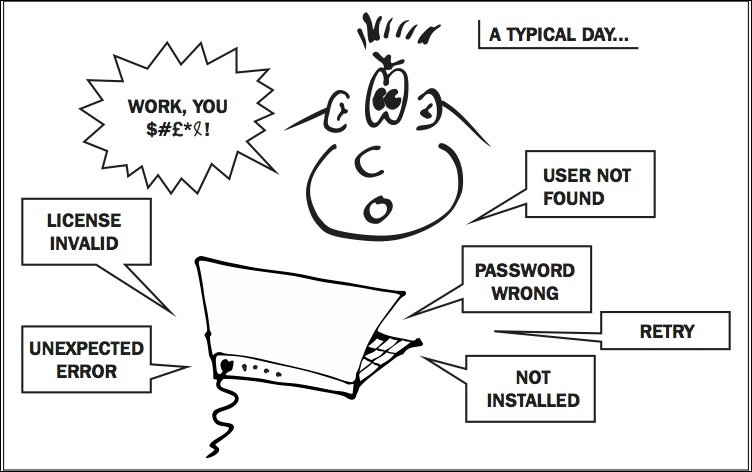

Lab 1. Getting started with Puppet
-----------------------------------------------


In this lab, you\'ll learn about some of the challenges of managing
configuration on servers, some common solutions to these problems, and
how automation tools such as Puppet can help. You\'ll also learn how to
download the GitHub repository containing all of the source code and
examples in this course, how to set up your own Vagrant virtual machine to
run the code, and how to download and install Puppet.

Whether you\'re a system administrator, a developer who needs to wrangle
servers from time to time, or just someone who\'s annoyed at how long it
takes to deploy a new app, you\'ll have come across the kind of problems
Puppet is designed to solve.





Why do we need Puppet anyway?
-----------------------------------------------


Managing applications and services in production is hard work, and there
are a lot of steps involved. To start with, you need
some servers to serve the services. Luckily, these are readily available
from your local cloud provider, at low, low prices. So you\'ve got a
server, with a base operating system installed on it, and you can log
into it. So now what? Before you can deploy, you need to do a number of
things:


- Add user accounts and passwords

- Configure security settings and privileges

- Install all the packages needed to run the app

- Customize the configuration files for each of these packages

- Create databases and database user accounts; load some initial data

- Configure the services that should be running

- Deploy the app code and static assets

- Restart any affected services

- Configure the machine for monitoring


That\'s a lot to do---and for the next server you build, you\'ll need to
do the exact same things all over again. There\'s something not right
about that. Shouldn\'t there be an easier solution to this problem?

**Wouldn\'t it be nice if you could write an executable specification
of how the server should be set up, and you could apply it to as many
machines as you liked?**


### Keeping the configuration synchronized


Setting up servers manually is tedious. Even if
you\'re the kind of person who enjoys tedium, though, there\'s another
problem to consider. What happens the next time you set up a server, a
few weeks or months later?

Your careful notes will no longer be up to date with reality. While you
were on vacation, the developers installed a couple of new libraries
that the app now depends on---I guess they forgot to tell you! They are
under a lot of schedule pressure, of course. You could send out a
sternly worded email demanding that people update the build document
whenever they change something, and people might even comply with that.
But even if they do update the documentation, no-one actually tests the
new build process from scratch, so when you come to do it, you\'ll find
it doesn\'t work anymore. Turns out that if you just upgrade the
database in place, it\'s fine, but if you install the new version on a
bare server, it\'s not.

Also, since the build document was updated, a new version of a critical
library was released upstream. Because you always install the latest
version as part of the build, your new server is now subtly different to
the old one. This will lead to subtle problems which will take you three
days, or three bottles of whiskey, to debug.

By the time you have four or five servers, they\'re all a little
different. Which is the authoritative one? Or are they all slightly
wrong? The longer they\'re around, the more they will drift apart. You
wouldn\'t run four or five different versions of your app code at once,
so what\'s up with that? Why is it acceptable for server configuration
to be in a mess like this?

**Wouldn\'t it be nice** ]  **if the state
of configuration on all your machines could be regularly checked and
synchronized with a central, standard version?**


### Repeating changes across many servers


Humans just aren\'t good at accurately repeating
complex tasks over and over; that\'s why we invented robots. It\'s easy
to make mistakes, miss things out, or be interrupted and lose track of
what you\'ve done.

Changes happen all the time, and it becomes increasingly difficult to
keep things up to date and in sync as your infrastructure grows. Again,
when you make a change to your app code, you don\'t go and make that
change manually with a text editor on each server. You change it once
and roll it out everywhere. Isn\'t your firewall setup just as much part
of your code as your user model?

**Wouldn\'t it be nice if you only had to make changes in one place,
and they rolled out to your whole network automatically?**


### Self-updating documentation


In real life, we\'re too busy to stop every five
minutes and document what we just did. As we\'ve seen, that
documentation is of limited use anyway, even if it\'s kept fanatically
up-to-date.

The only reliable documentation, in fact, is the state of the servers
themselves. You can look at a server to see how it\'s configured, but
that only applies while you still have the machine. If something goes
wrong and you can\'t access the machine, or the data on it, your only
option is to reconstruct the lost configuration from scratch.

**Wouldn\'t it be nice if you had a clear, human-readable build
procedure which was independent of your servers, and was guaranteed to
be up to date, because the servers are actually built from
it?**


### Version control and history


When you\'re making manual, ad hoc changes to
systems, you can\'t roll them back to a point in time. It\'s hard to
undo a whole series of changes; you don\'t have a way of keeping track
of what you did and how things changed.

This is bad enough when there\'s just one of you. When you\'re working
in a team, it gets even worse, with everybody making independent changes
and getting in each other\'s way.

When you have a problem, you need a way to know what changed and when,
and who did it. And you also need to be able to set your configuration
back to any previously stable state.

**Wouldn\'t it be nice if you could go back in time?**


### Why not just write shell scripts?


Many people manage configuration with shell scripts,
which is better than doing it manually, but not much. Some of the
problems with shell scripts include the following:


- Fragile and non-portable

- Hard to maintain

- Not easy to read as documentation

- Very site-specific

- Not a good programming language

- Hard to apply changes to existing servers


### Why not just use containers?


Containers! Is there any word more thrilling to the
human soul? Many people feel as though containers are going to make
configuration management problems just go away. This feeling rarely
lasts beyond the first few hours of trying to containerize an app. Yes,
containers make it easy to deploy and manage software, but where do
containers come from? It turns out someone has to build and maintain
them, and that means managing Dockerfiles, volumes, networks, clusters,
image repositories, dependencies, and so on. In other words,
configuration. There is an axiom of computer science which I just
invented, called [*The Law of Conservation of Pain*]. If you
save yourself pain in one place, it pops up again in another. Whatever
cool new technology comes along, it won\'t solve all our problems; at
best, it will replace them with refreshingly different problems.

Yes, containers are great, but the truth is,
container-based systems require even more configuration management. You
need to configure the nodes that run the containers, build and update
the container images based on a central policy, create and maintain the
container network and clusters, and so on.


### Why not just use serverless?


If containers are powered by magic pixies,
serverless architectures are pure fairy dust. The promise is that you
just push your app to the cloud, and the cloud takes care of deploying,
scaling, load balancing, monitoring, and so forth. Like most things, the
reality doesn\'t quite live up to the marketing. Unfortunately,
serverless isn\'t actually serverless: it just means your business is
running on servers you don\'t have direct control over, plus, you have
higher fixed costs because you\'re paying someone else to run them for
you. Serverless can be a good way to get started, but it\'s not a
long-term solution, because ultimately, you need to own your own
configuration.


Configuration management tools
------------------------------------------------


**Configuration** ] 
**management** (**CM**) tools are the modern,
sensible way to manage infrastructure as code. There are many such tools
available, all of which operate more or less the same way: you specify
your desired configuration state, using editable text files and a model
of the system\'s resources, and the tool compares the current state of
each **node** (the term we use for configuration-managed
servers) with your desired state and makes any changes necessary to
bring it in line.

As with most unimportant things, there is a great deal of discussion and
argument on the Internet about which CM tool is the best. While there
are significant differences in approaches and capabilities between
different tools, don\'t let that obscure the fact that using a tool of
any sort to manage configuration is much better than trying to do it by
hand.

That said, while there are many CM tools available, Puppet is an
excellent choice. No other tool is more powerful, more portable, or more
widely adopted. In this course, I\'m going to show you what makes Puppet
so good and the things that only Puppet can do.


What is Puppet?
---------------------------------


Puppet is two things: a language for expressing the
desired state (how your nodes should be configured), and an engine that
interprets code written in the Puppet language and applies it to the
nodes to bring about the desired state.

What does this language look like? It\'s not exactly a series of
instructions, like a shell script or a Ruby program. It\'s more like a
set of declarations about the way things should be. Have a look at the
following example:

``` 
package { 'curl':
  ensure => installed,
}
```


In English, this code says, \"The `curl` package should be
installed.\" When you apply this manifest (Puppet programs are called
manifests), the tool will do the following:


1.  Check the list of installed packages on the node to see if
    `curl` is already installed.

2.  If it is, do nothing.

3.  If not, install it.


Here\'s another example of Puppet code:

``` 
user { 'bridget':
  ensure => present,
}
```


This is Puppet language for the declaration, \"The `bridget`
user should be present.\" (The keyword `ensure` means \"the
desired state of the resource is\...\"). Again, this results in Puppet
checking for the existence of the `bridget` user on the node,
and creating it if necessary. This is also a kind of documentation that
expresses human-readable statements about the system in a formal way.
The code expresses the author\'s desire that Bridget should always be
present.

So you can see that the Puppet program---the Puppet
**manifest**---for your configuration is a set of
declarations about what things should exist, and how they should be
configured.

You don\'t give commands, like \"Do this, then do that\". Rather, you
describe how things should be, and let Puppet take care of making it
happen. These are two quite different kinds of programming. One kind (so-called procedural style) is the
traditional model used by languages such as C, Python, shell, and so on.
Puppet\'s is called declarative style because you
declare what the end result should be, rather than specify the steps to
get there.

This means that you can apply the same Puppet manifest repeatedly to a
node and the end result will be the same, no matter
how many times you apply the manifest. It\'s better to think of Puppet
manifests as a kind of specification, or declaration, rather than as a
program in the traditional sense.


### Resources and attributes


Puppet lets you describe configuration in terms of
**resources** (types of things that can exist, such as users, files, or packages) and their
**attributes** (appropriate properties for the type of
resource, such as the home directory for a user, or the owner and
permissions for a file). You don\'t have to get into the details of how
resources are created and configured on different platforms. Puppet
takes care of it.

The power of this approach is that a given manifest can be applied to
different nodes, all running different operating systems, and the
results will be the same everywhere.


### Puppet architectures


It\'s worth noting that there are two different ways
to use Puppet. The first way, known as
**agent/master architecture**, uses a special node dedicated
to running Puppet, which all other nodes contact to get their
configuration.

The other way, known as **stand-alone
Puppet** or **masterless**, does not need a special
Puppet master node. Puppet runs on each individual node and does not
need to contact a central location to get its configuration. Instead,
you use Git, or any other way of copying files to the node, such as SFTP
or `rsync`, to update the Puppet manifests on each node.

Both stand-alone and agent/master architectures are officially supported
by Puppet. It\'s your choice which one you prefer to use. In this course,
I will cover only the stand-alone architecture, which is simpler and
easier for most organizations, but almost everything in the course will
work just the same whether you use agent/master or stand-alone Puppet.


#### Note

To set up Puppet with an agent/master architecture, consult the official
Puppet documentation.


Getting ready for Puppet
------------------------------------------


Although Puppet is inherently cross-platform and
works with many different operating systems, for the purposes of this
course, I\'m going to focus on just one operating system, namely the
**Ubuntu 16.04 LTS** distribution of Linux, and the most
recent version of Puppet, Puppet 5. However, all the examples in the
course should work on any recent operating system or Puppet version with
only minor changes.

You will probably find that the best way to read this course is to follow
along with the examples using a Linux machine of your own. It doesn\'t
matter whether this is a physical server, desktop or laptop, cloud
instance, or a virtual machine. I\'m going to use the popular Vagrant
software to run a virtual machine on my own computer, and you can do the
same. The public GitHub repository for this course contains a Vagrantfile,
which you can use to get up and running with Puppet in just a few steps.


### Installing Git and downloading the repo


To get a copy of the repo that accompanies this
course, follow these steps:


1.  Browse to <https://git-scm.com/downloads>

2.  Download and install the right version of Git for your operating
    system.

3.  Run the following command:

    ``` 
    git clone https://github.com/bitfield/puppet-beginners-guide-3.git
    ```
    


### Installing VirtualBox and Vagrant


If you already have a Linux machine or cloud server
you\'d like to use for working through the examples,
skip this section and move on to the next lab. If you\'d like to use
VirtualBox and Vagrant to run a local **virtual machine**
(**VM**) on your computer to use with the examples, follow
these instructions:


1.  Browse to <https://www.virtualbox.org/>

2.  Download and install the right version of VirtualBox for your
    operating system

3.  Browse to <https://www.vagrantup.com/downloads.html>

4.  Select the right version of Vagrant for your operating system: OS X,
    Windows, and so on

5.  Follow the instructions to install the software


### Running your Vagrant VM


Once you have installed Vagrant, you can start the
Puppet Beginner\'s Guide virtual machine:


1.  Run the following commands:

    ``` 
    cd puppet-beginners-guide-3
    scripts/start_vagrant.sh
    ```
    

    Vagrant will begin downloading the base box. Once that has booted,
    it will install Puppet. This may take a while, but once the
    installation is complete, the virtual machine will be ready to use.

2.  Connect to the VM with the following command:

    ``` 
    vagrant ssh
    ```
    

3.  You now have a command-line shell on the VM.
    Check that Puppet is installed and working by running the following
    command (you may get a different version number, which is fine):

    ``` 
    puppet --version
    5.2.0
    ```
    

    
    #### Note

    If you\'re using Windows, you may need to install the PuTTY software
    to connect to your VM. There is some helpful advice about using
    Vagrant on Windows at:

    <http://tech.osteel.me/posts/2015/01/25/how-to-use-vagrant-on-windows.html>
    


### Troubleshooting Vagrant


If you have any problems running the VM, look for
help on the VirtualBox or Vagrant websites. In
particular, if you have an older machine, you may see a message like the
following:

``` 
VT-x/AMD-V hardware acceleration is not available on your system. Your 64-bit guest will fail to detect a 64-bit CPU and will not be able to boot.
```


Your computer may have a BIOS setting to enable 64-bit hardware
virtualization (depending on the manufacturer, the trade name for this
is either **VT-x** or **AMD-V**). Enabling this
feature may fix the problem. If not, you can try the 32-bit version of
the Vagrant box instead. Edit the file named `Vagrantfile` in
the Git repository, and comment out the following line with a leading
`#` character:

``` 
config.vm.box = "ubuntu/xenial64"
```


Uncomment the following line by removing the leading
`#` character:

``` 
# config.vm.box = "ubuntu/xenial32"
```


Now re-run the `scripts/start_vagrant.sh` command.


Summary
-------------------------


In this lab, we looked at the various problems that configuration
management tools can help solve, and how Puppet in particular models the
aspects of system configuration. We checked out the Git repository of
example code for this course, installed VirtualBox and Vagrant, started
the Vagrant VM, and ran Puppet for the first time.

In the next lab, we\'ll write our first Puppet manifests, get some
insight into the structure of Puppet resources and how they\'re applied,
and learn about the `package`, `file`, and
`service` resources.
