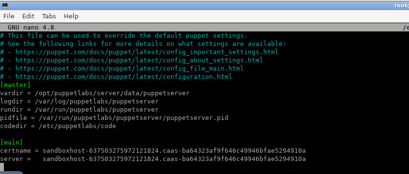

Lab 10. Puppet Master and Agent 
--------------------------------

In this lab, we will install Puppet server and agent on Ubuntu 20.04 server.


Getting Started
---------------

First, you will need to update all packages on Puppet master and Puppet
client systems. You can update them by running the following command:

```
apt-get update -y
```

Once all the packages are up-to-date, you can proceed to the next step.


Setup Hostname Resolution
-------------------------

Next, you will need to setup hostname on both nodes. So each node can
communicate with each other by hostname. You can do it by editing
/etc/hosts file.Add the following lines on the node:

```
echo "127.0.0.1 puppetmaster puppet" >> /etc/hosts
echo "127.0.0.1 puppetclient" >> /etc/hosts

cat  /etc/hosts
```


Save and close the file when you are finished. Then, you can proceed to
the next step.


Install Puppet Server
---------------------

First, you will need to install the Puppet server on the master node. By
default, the Puppet package is not available in the Ubuntu 20.04 default
repository. So you will need to install the Puppet repository in your
server.

First, download the latest version of Puppet with the following command:

```
wget https://apt.puppetlabs.com/puppet5-release-xenial.deb
```

Once the package is downloaded, install it by running the following
command:

```
dpkg -i puppet5-release-xenial.deb
```

Once the installation is completed, update the repository and install
the Puppet server by running the following command:

```
apt-get update -y

apt-get install puppetserver -y
```

Start the Puppet service with the following command (it will take some time):

```
service puppetserver restart
```


Next, you can verify the status of the Puppet service with the following
command:

```
service puppetserver status
```

You should see the following command:

    * puppetserver is running


Once you are finished, you can proceed to the next step.


Install and Configure Puppet Agent
----------------------------------

At this point, the Puppet server is installed and configure. Now, you
will need to install the Puppet agent on the client node.

First, download and install the Puppet repository with the following
command:

```
wget https://apt.puppetlabs.com/puppet5-release-xenial.deb

dpkg -i puppet5-release-xenial.deb
```

Next, update the repository and install the Puppet agent by running the
following command:Advertisement

```
apt-get update -y

apt-get install puppet-agent -y
```

After installing Puppet agent, you will need to edit the Puppet
configuration file and define the Puppet master information:

```
nano /etc/puppetlabs/puppet/puppet.conf
```

Add the following lines:

```
[main]
certname = puppetclient
server = puppetmaster
```


#### Connect with Puppet Master

On the Puppet agent node, test the Puppet master and agent communication
with the following command:

```
/opt/puppetlabs/bin/puppet agent --test
```

Note that about connection will fail because when need to accept connect request from agent on the master node. At this point, the Puppet agent is installed and configured. Now, you can proceed to the next step.


Sign Puppet Agent Certificate
-----------------------------

Puppet uses a client-server architecture so you will need to approve a
certificate request for each agent node before it can configure it.

On the Puppet master node, run the following command to list all
certificate:

```
/opt/puppetlabs/bin/puppetserver ca list
```

Now, sign the certificate with the following command:


```
/opt/puppetlabs/bin/puppetserver ca sign puppetclient
```


#### Connect with Puppet Master

On the Puppet agent node, test the Puppet master and agent communication
with the following command:

```
/opt/puppetlabs/bin/puppet agent --test
```

**Note:** You will get a master `hostname` mismatch error because we set hostname as `puppetmaster`. We need to use exact hostname of the lab environment which is read-only. Copy complete red highlighed hostname displayed by puppet in error message carefully as shown below:


    

Edit the Puppet configuration file and update the Puppet master information:

```
nano /etc/puppetlabs/puppet/puppet.conf
```

Update the following lines:

```
[main]
certname = "update-lab-environment-hostname"
server = "update-lab-environment-hostname"
```


   

Run folowing command in terminal 1 test the Puppet master and agent communication:

```
puppet agent -t --waitforcert 500000
```


Run following commands in terminal 2 to sign the certificate:

```
puppetserver ca list

puppetserver ca sign "your-cert-name"
```


### Note:

Now, Puppet master can able to communicate and control the agent node.

On the Puppet agent node, test the Puppet master and agent communication
with the following command:

```
puppet agent -t
```

If everything is fine, you should get the following output:

    Info: Using configured environment 'production'
    Info: Retrieving pluginfacts
    Info: Retrieving plugin
    Info: Retrieving locales
    Info: Caching catalog for puppetclient
    Info: Applying configuration version '1599300398'
    Notice: Applied catalog in 0.02 seconds


Task: Create New File
-----------------------

Create new file '/tmp/agent.txt' by writing puppet manifest and apply to agent node:


**Hint:**

```
node 'hostname' {

        # write here 
}
```


  

Conclusion
----------

Congratulations! you have successfully installed and configured Puppet
master and agent on Ubuntu server. You can now easily add multiple
agents and manage them easily with Puppet.
