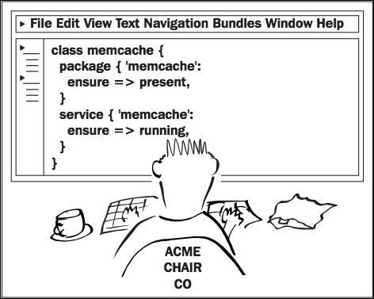
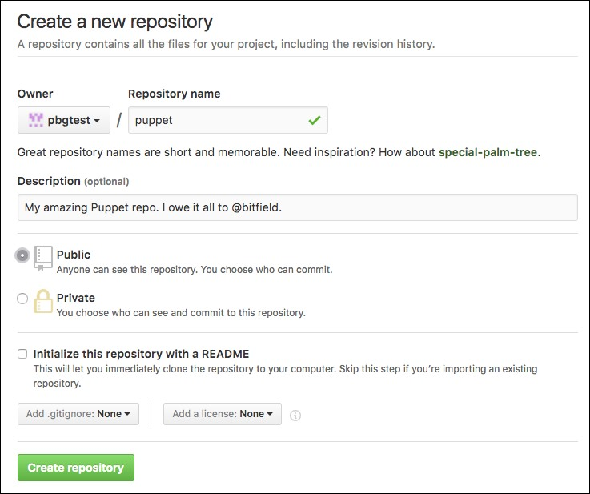
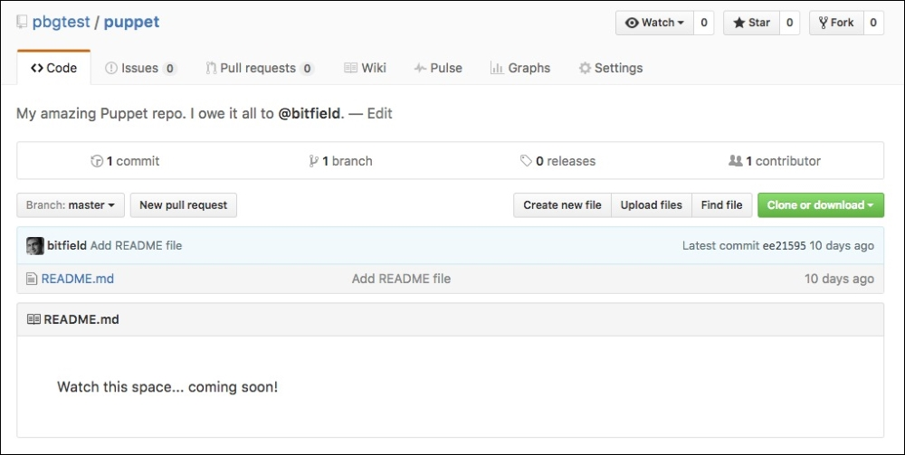

Lab 10. Managing your Puppet code with Git
------------------------------------------------------


In this lab, you\'ll learn how to use the Git version control system
to manage your Puppet manifests. I\'ll also show you how to use Git to
distribute the manifests to multiple nodes, so that you can start
managing your whole network with Puppet.





Creating a Git repo
-------------------------------------


It\'s very easy to create a Git repo. Follow these steps:


1.  Make a directory to hold your versioned files using the following
    commands:

    ``` 
    cd
    mkdir puppet
    ```
    

2.  Now run the following commands to turn the
    directory into a Git repo:

    ``` 
    cd puppet
    git init
    Initialized empty Git repository in /home/ubuntu/puppet/.git/
    ```
    


### Making your first commit


You can change the files in your repo as much as you
like, but Git will not know about the changes until you make what\'s
called a **commit**. You can think of a commit as being like a snapshot of the repo at a particular
moment, but it also stores information about what changed in the repo
since the previous commit. Commits are stored forever, so you will
always be able to roll back the repo to the state it was in at a certain
commit, or show what files were changed in a past commit and compare
them to the state of the repo at any other commit.

Let\'s make our first commit to the new repo:


1.  Because Git records not only changes to the code, but also who made
    them, it needs to know who you are. Set your identification details
    for Git (use your own name and email address, unless you
    particularly prefer mine) using the following commands:

    ``` 
    git config --global user.name "Puppet QuickStart"
    git config --global user.email john@fenago.com
    ```
    

2.  It\'s traditional for Git repos to have a `README` file,
    which explains what\'s in the repo and how to use it. For the
    moment, let\'s just create this file with a placeholder message:

    ``` 
    echo "Watch this space... coming soon!" >README.md
    ```
    

3.  Run the following command:

    ``` 
    git status
    On branch master
    Initial commit
    Untracked files:
      (use "git add <file>..." to include in what will be committed)
            README.md
    nothing added to commit but untracked files present (use "git add" to track)
    ```
    

4.  Because we\'ve added a new file to the repo, changes to it won\'t be
    tracked by Git unless we explicitly tell it to. We do this by using
    the `git add` command, as follows:

    ``` 
    git add README.md
    ```
    

5.  Git now knows about this file, and changes to it will be included in
    the next commit. We can check this by running
    `git status` again:

    ``` 
    git status
    On branch master
    Initial commit
    Changes to be committed:
      (use "git rm --cached <file>..." to unstage)
            new file:   README.md
    ```
    

6.  The file is listed under `Changes to be committed`, so we
    can now actually make the commit:

    ``` 
    git commit -m 'Add README file'
    [master (root-commit) ee21595] Add README file
     1 file changed, 1 insertion(+)
     create mode 100644 README.md
    ```
    

7.  You can always see the complete history of commits in a repo by
    using the `git log` command. Try it now to see the commit
    you just made:

    ``` 
    git log
    commit ee215951199158ef28dd78197d8fa9ff078b3579
    Author: Puppet QuickStart <john@fenago.com>
    Date:   Tue Aug 30 05:59:42 2016 -0700
        Add README file
    ```
    


Distributing Puppet manifests
-----------------------------------------------

In the following sections, we\'ll create a GitHub account, push our new
Puppet repo to GitHub, and then set up our virtual machine to
automatically pull any changes from the GitHub repo and apply them with
Puppet.


### Creating a GitHub account and project


If you already have a GitHub account, or you\'re
using another Git server, you can skip this section.


1.  Browse to <https://github.com/>

2.  Enter the username you want to use, your email address, and a
    password.

3.  Choose the **Unlimited public repositories for free**
    plan.

4.  GitHub will send you an email to verify your email address. When you
    get the email, click on the verification link.

5.  Select **Start a project**.

6.  Enter a name for your repo (I suggest `puppet`, but it
    doesn\'t matter).

7.  Free GitHub accounts can only create public repos, so select
    **Public**.

    
    #### Note

    Be careful what information you put into a public Git repo, because
    it can be read by anybody. Never put passwords, login credentials,
    private keys, or other confidential information into a repo like
    this unless it is encrypted.

8.  Click **Create repository**.

9.  GitHub will show you a page of instructions about how to initialize
    or import code into your new repository. Look
    for the `https` URL which identifies your repo; it will be
    something like this
    (`https://github.com/pbgtest/puppet.git`):

    

    


### Pushing your repo to GitHub


You\'re now ready to take the Git repo you created
locally earlier in this lab and push it to
GitHub so that you can share it with other nodes.


1.  In your repo directory, run the following commands. After
    `git remote add origin`, specify the URL to your GitHub
    repo:

    ``` 
    git remote add origin YOUR_REPO_URL
    git push -u origin master
    ```
    

2.  GitHub will prompt you for your username
    and password:

    ``` 
    Username for 'https://github.com': pbgtest
    Password for 'https://pbgtest@github.com':
    Counting objects: 3, done.
    Writing objects: 100% (3/3), 262 bytes | 0 bytes/s, done.
    Total 3 (delta 0), reused 0 (delta 0)
    To https://github.com/pbgtest/puppet.git
     * [new branch]      master -> master
    Branch master set up to track remote branch master from origin.
    ```
    

3.  You can check that everything has worked properly by visiting the
    repo URL in your browser. It should look something like this:

    

    


### Cloning the repo


In order to manage multiple nodes with Puppet, you
will need a copy of the repo on each node. If you
have a node you\'d like to manage with Puppet, you can use it in this
example.

Run the following commands (replace the argument to
`git clone` with the URL of your own GitHub repo, but don\'t
lose the `production` at the end):

``` 
cd /etc/puppetlabs/code/environments
sudo mv production production.sample
sudo git clone YOUR_REPO_URL production
Cloning into 'production'...
remote: Counting objects: 3, done.
remote: Total 3 (delta 0), reused 3 (delta 0), pack-reused 0
Unpacking objects: 100% (3/3), done.
Checking connectivity... done.
```


How does this work? The standard place for Puppet manifests in a
production environment is the
`/etc/puppetlabs/code/environments/production/` directory, so
that\'s where our cloned repo needs to end up.
However, the Puppet package installs some sample manifests in that
directory, and Git will refuse to clone into a directory that already
exists, so we move that directory out of the way with the
`mv production production.sample` command. The
`git clone` command then recreates that directory, but this
time it contains our manifests from the repo.


Fetching and applying changes automatically
-------------------------------------------------------------


In a stand-alone Puppet architecture, each node
needs to automatically fetch any changes from the
Git repo at regular intervals, and apply them with Puppet. We can use a
simple shell script for this, and there\'s one in the example repo
(`/examples/files/run-puppet.sh`):

``` 
#!/bin/bash
cd /etc/puppetlabs/code/environments/production && git pull
/opt/puppetlabs/bin/puppet apply manifests/
```


We will need to install this script on the node to be managed by Puppet,
and create a cron job to run it regularly (I suggest every 15 minutes).
Of course, we could do this work manually, but isn\'t this course partly
about the advantages of automation? Very well, then: let\'s practice
what we\'re preaching.


### Writing a manifest to set up regular Puppet runs


In this section, we\'ll create the necessary Puppet
manifests to install the `run-puppet` script on a node and run
it regularly from cron:


1.  Run the following commands to create the required directories in
    your Puppet repo:

    ``` 
    cd /home/ubuntu/puppet
    mkdir manifests files
    ```
    

2.  Run the following command to copy the `run-puppet` script
    from the `examples/` directory:

    ``` 
    cp /examples/files/run-puppet.sh files/
    ```
    

3.  Run the following command to copy the `run-puppet`
    manifest from the `examples/` directory:

    ``` 
    cp /ubuntu/examples/run-puppet.pp manifests/
    ```
    

4.  Add and commit the files to Git with the following commands:

    ``` 
    git add manifests files
    git commit -m 'Add run-puppet script and cron job'
    git push origin master
    ```
    

Your Git repo now contains everything you need to automatically pull and
apply changes on your managed nodes. In the next section, we\'ll see how
to set up this process on a node.


#### Note

You might have noticed that every time you push files to your GitHub
repo, Git prompts you for your username and password. If you want to
avoid this, you can associate an SSH key with your GitHub account. Once
you\'ve done this, you\'ll be able to push without having to re-enter
your credentials every time. For more information about using an SSH key
with your GitHub account see this article:

<https://help.github.com/articles/adding-a-new-ssh-key-to-your-github-account/>


### Applying the run-puppet manifest


Having created and pushed the manifest necessary to
set up automatic Puppet runs, we now need to pull and apply it on the
target node.

In the cloned copy of your repo in
`/etc/puppetlabs/code/environments/production`, run the
following commands:

``` 
sudo git pull
puppet apply manifests/
Notice: Compiled catalog for localhost in environment production in 0.08 seconds
Notice: /Stage[main]/Main/File[/usr/local/bin/run-puppet]/ensure: defined content as '{md5}83a6903e69564bcecc8fd1a83b1a7beb'
Notice: /Stage[main]/Main/Cron[run-puppet]/ensure: created
Notice: Applied catalog in 0.07 seconds
```


You can see from Puppet\'s output that it has created the
`/usr/local/bin/run-puppet` script and the
`run-puppet` cron job. This will now run automatically every
15 minutes, pull any new changes from the Git repo, and apply the
updated manifest.


### The run-puppet script


The `run-puppet` script does the following
two things in order to automatically update the
target node:


1.  Pull any changes from the Git server (`git pull`).

2.  Apply the manifest (`puppet apply`).


Our Puppet manifest in `run-puppet.pp` deploys this script to
the target node, using a `file` resource, and then sets up a
cron job to run it every 15 minutes, using a `cron` resource.


For now, just note that the `cron` resource has a name
(`run-puppet`), which is just for the benefit of us humans, to
remind us what it does, and it also has a `command` to run and
`hour` and `minute` attributes to control when it
runs. The value `*/15` tells `cron` to run the job
every 15 minutes.


### Testing automatic Puppet runs


To prove that the automatic Puppet run works, make a
change to your manifest which creates a file
(`/tmp/hello.txt`, for example). Commit and push this change
to Git. Wait 15 minutes, and check your target node. The file should be
present. If not, something is broken. To troubleshoot the problem, try
running `sudo run-puppet` manually. If this works, check that
the cron job is correctly installed by running
`sudo crontab -l`. It should look something like the
following:

``` 
# HEADER: This file was autogenerated at 2017-04-05 01:46:03 -0700 by puppet.
# HEADER: While it can still be managed manually, it is definitely not recommended.
# HEADER: Note particularly that the comments starting with 'Puppet Name' should
# HEADER: not be deleted, as doing so could cause duplicate cron jobs.
# Puppet Name: run-puppet
*/15 * * * * /usr/local/bin/run-puppet
```


### Managing multiple nodes


You now have a fully automated stand-alone Puppet
infrastructure. Any change that you check in to your Git repo will be
automatically applied to all nodes under Puppet management. To add more
nodes to your infrastructure, follow these steps for each new node:


1.  Install Puppet.

2.  Clone your Git repo (as described in the [*Cloning the repo*] section).

3.  Apply the manifest (as described in the [*Applying the run-puppet manifest*] section).


You might be wondering how to tell Puppet how to apply different
manifests to different nodes. For example, you might be managing two
nodes, one of which is a web server and the other a database server.
Naturally, they will need different resources.


Summary
-------------------------


In this lab, we introduced the concepts of version control, and the
essentials of Git in particular. We set up a new Git repo, created a
GitHub account, pushed our code to it, and cloned it on a node. We wrote
a shell script to automatically pull and apply changes from the GitHub
repo on any node, and a Puppet manifest to install this script and run
it regularly from `cron`.

In the next lab, we\'ll explore the power of Puppet resources, going
into more detail about the Puppet `file`, `package`,
and `service` resources we\'ve already encountered, and
introducing three more important resource types: `user`,
`cron`, and `exec`.
